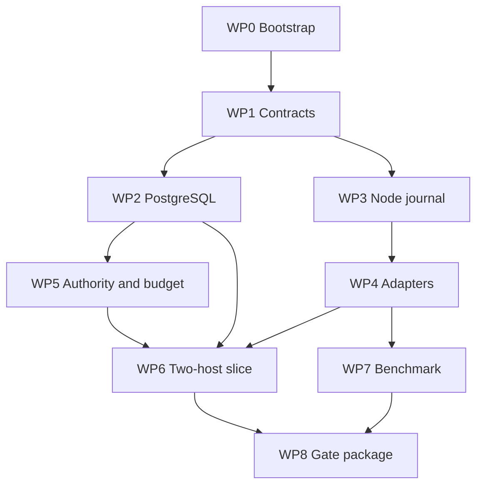

# ReasonBraid Phase 0 Kickoff

**Status:** Immediate execution plan  
**Version:** 0.1.0  
**Date:** 2026-09-04  
**Governing roadmap:** [`ROADMAP.md`](ROADMAP.md) (v0.4.1)  
**Effort envelope:** 8–14 engineer-weeks, followed by re-estimation from evidence

> Companion to `ROADMAP.md`. Scope, architecture, and gates live in the master
> roadmap. This file is the Phase 0 day-to-day execution plan: work packages,
> kill-risk questions, repository shape, and the first fifteen issues.

## 1. Phase objective

Build the smallest executable foundation that can answer the project’s kill-risk questions:

1. Can a Rust control plane and Rust node preserve accepted work across crashes and reconnects?
2. Can a real coding-agent harness be supervised through a narrow adapter without contaminating the core domain model?
3. Can two agents on different hosts participate in one durable thread without a human relaying messages?
4. Can the system report an indeterminate provider attempt honestly instead of blindly retrying it?
5. Are the identity, authority, budget, and event contracts small enough to evolve beside working code?
6. Does even a minimal structured exchange provide enough value to justify continuing toward semantic discovery and governance?

Phase 0 is not intended to implement the product. It must produce code, measurements, failures, and decisions that constrain Phase 1.

## 2. Operating rules

- Keep the repository public (director correction, 2026-09-09; docs/decisions/2026-09-09_public-repository-policy.md). ADR-001 still governs name/package/domain clearance.
- Treat roadmap v0.4.1 as frozen. Put non-blocking ideas in `docs/parking-lot.md`.
- Every experiment has a question, competing options, fixture, observable result, decision owner, and deletion plan.
- Build one end-to-end path early; do not complete all domain types before running a real adapter.
- Prefer the modular monolith and ordinary Tokio tasks. Add an actor framework or broker only if an experiment demonstrates the need.
- Do not promise exactly-once provider execution or billing.
- Do not add semantic search, arbitrary Web acquisition, policy compilation, federation, browser workers, or a production UI during Phase 0.
- At the exit review, complete the subtraction record before proposing Phase 1 scope.

## 3. Minimal repository shape

Start with one Cargo workspace:

```text
reasonbraid/
  Cargo.toml
  Cargo.lock
  rust-toolchain.toml
  deny.toml
  README.md
  LICENSE
  crates/
    reasonbraid-core/       # IDs, envelopes, minimal thread and attempt states
    reasonbraid-server/     # HTTP/SSE, command handlers, PostgreSQL transactions
    reasonbraid-node/       # outbound connection, SQLite journal, execution supervisor
    reasonbraid-adapter/    # narrow trait/protocol, fake and first real adapter
    reasonbraid-cli/        # enroll, create thread, contribute, inspect events/attempts
  migrations/
  specs/
    schemas/
    fixtures/
  tests/
    integration/
    failure/
  docs/
    adr/
    evidence/
    decisions/
    risks.md
    parking-lot.md
```

Do not reproduce the final roadmap workspace on day one. Add another crate only when a security boundary, separately deployed process, dependency conflict, or demonstrated compile/test cost requires it.

Initial automated checks:

- pinned stable Rust toolchain and MSRV decision;
- `cargo fmt --check`;
- `cargo clippy --workspace --all-targets --all-features -- -D warnings`;
- `cargo test --workspace`;
- dependency/advisory/license checks;
- secret scanning;
- PostgreSQL and SQLite integration tests in CI;
- reproducible command for the two-host demo environment.

## 4. Work packages

Effort ranges overlap where two engineers work in parallel; manage the total against the 8–14 engineer-week envelope.

### WP0 — Bootstrap and decision log

**Effort:** 0.5–1 engineer-week.  
**Output:** public repository, ownership, contribution rules, ADR/evidence templates, CI skeleton, and visible project risks.

Acceptance:

- ADR-001 records ReasonBraid as an uncleared working name, allows the public repository and keeps package/domain clearance open;
- one person is accountable for final architecture decisions and one for release/security gate records, even if the same small team fills several implementation roles;
- every external dependency entry includes source, checked date, version, and revalidation trigger;
- v0.5.0 cannot be created without the Phase 0 evidence manifest and LAN-slice evidence.

### WP1 — Minimal contracts

**Effort:** 1–2 engineer-weeks.  
**Depends on:** WP0.

Implement only the types required by the first slice:

- tenant, human principal, host, node, agent role, agent incarnation, run, and thread IDs;
- command submission envelope and committed event envelope;
- authority context reference, idempotency key/scope, expected aggregate revision, causal references, trace ID, and schema version;
- minimal thread states: `open`, `closing`, `closed`, `cancelled`;
- minimal participation states: `invited`, `accepted`, `declined`, `expired`, `left`;
- provider attempt states: `prepared`, `dispatched`, `completed`, `failed_before_dispatch`, `outcome_unknown`, `reconciled`;
- typed errors and stable reason-code registry.

Acceptance:

- JSON Schema/golden fixtures exist for every wire payload used by the demo;
- invalid transitions and idempotency hash conflicts are rejected deterministically;
- agent role, incarnation, run, and provider attempt cannot be confused in types or serialized records;
- no policy, evidence-graph, semantic-directory, federation, or deployment entities are added.

### WP2 — PostgreSQL transaction and outbox experiment

**Effort:** 1–2 engineer-weeks.  
**Depends on:** WP1.

Build a thin aggregate/update path that writes current state, ordered event, idempotency result, and outbox item in one transaction. A worker claims outbox work with a lease and fencing value.

Inject termination:

1. before transaction commit;
2. after commit but before response;
3. after outbox claim but before delivery;
4. after delivery but before acknowledgement;
5. after acknowledgement but before worker completion.

Acceptance:

- a successful response always corresponds to committed durable state;
- resubmission with the same key and request hash returns the original semantic result;
- resubmission with a different hash is a conflict;
- transport redelivery produces one domain effect;
- stale leased workers cannot commit after a newer fencing value;
- the evidence report states measured recovery behavior and rejected designs.

### WP3 — Node SQLite journal and reconnect experiment

**Effort:** 1.5–2 engineer-weeks.  
**Depends on:** WP1; may proceed beside WP2.

The Rust node connects outbound, enrolls under a development identity, receives a run command, persists it, invokes an adapter, persists the result, emits an event, and acknowledges completion. Use WAL mode and an explicit development durability setting.

Inject termination before and after every journal transition. Exercise network loss, server restart, duplicate command, cursor rewind, expired lease, and node replacement.

Acceptance:

- reconnect exchanges the last acknowledged server cursor and pending local operation IDs;
- a duplicated command never creates a second local ReasonBraid operation;
- a crash after possible provider dispatch yields `outcome_unknown` unless the adapter can prove the result;
- the node does not become schedulable until reconciliation completes;
- operators can inspect pending and ambiguous journal entries without opening SQLite manually.

### WP4 — Adapter boundary, fake adapter, and first real harness

**Effort:** 1.5–2.5 engineer-weeks.  
**Depends on:** WP1 and enough of WP3 to journal attempts.

First implement a deterministic fake adapter that can stream, fail, hang, report usage, ignore cancellation, and simulate a lost response after dispatch. Then implement one real adapter—Codex-family or Claude-family—using the narrowest supported CLI/SDK boundary available on the selected development host.

The adapter contract reports capabilities rather than pretending all harnesses behave alike:

```text
invoke(request, operation_id, deadline, budget)
cancel(operation_id)
query_status(operation_id) -> supported | unsupported | result
normalize_usage(raw_receipt)
capabilities() -> streaming, cancellation, provider idempotency,
                  status lookup, tool support, policy injection mode
```

Acceptance:

- credentials never enter thread content, events, or fixtures;
- dispatch acknowledgement is distinct from completion;
- unsupported status lookup produces `outcome_unknown`, not a retry recommendation;
- sanitized deterministic fixtures cover every adapter outcome;
- vendor-specific DTOs do not enter `reasonbraid-core`;
- the evidence report recommends whether the second real adapter belongs in late Phase 0 or Phase 1.

### WP5 — Minimal identity, authority, and budget controls

**Effort:** 0.5–1 engineer-week.  
**Depends on:** WP1–WP2.

Use development credentials; do not build the final certificate issuer. Implement enough deterministic authorization to prove that a principal can create a thread, invite a named agent, contribute, and inspect only an allowed tenant/thread. Establish a development `EnrollmentAuthorityBoundary` and a per-thread call/token/time ceiling.

Acceptance:

- tenant membership alone does not grant mandate or administrative authority;
- every command records actor, subject if delegated, grant/boundary reference, decision, and policy digest/version;
- a grant cannot exceed the enrollment ceiling;
- no provider dispatch begins without an applicable budget reservation;
- authorization and budget denial tests cross both server and node boundaries.

### WP6 — Two-host vertical experiment

**Effort:** 1–1.5 engineer-weeks.  
**Depends on:** WP2–WP5.

Run the control plane and PostgreSQL on one development host and a node on another host. A CLI user creates a thread, invites an agent, receives an independent contribution, posts a challenge, receives a revision, and closes the thread. If the second real adapter is ready, use two nodes/harnesses; otherwise use one real and one deterministic fake and record that limitation.

During the demonstration:

- disconnect and reconnect one node;
- duplicate at least one delivery;
- kill one attempt after simulated or real dispatch;
- exhaust one budget dimension;
- show the ordered audit/event view and ambiguous attempt.

Acceptance:

- no human copies messages between harnesses;
- every accepted command survives restart;
- duplicate transport messages create one domain effect;
- no indeterminate provider call is silently retried;
- thread closure preserves contributions and unresolved objections;
- a reproducible script and evidence bundle allow another developer to repeat the demo.

### WP7 — Small deliberation/routing benchmark

**Effort:** 0.5–1 engineer-week plus review.  
**Depends on:** fake adapter and at least one real adapter; may use an offline harness if the vertical slice is unfinished.

Use a small versioned corpus containing factual, code-review, ambiguous-policy, and “insufficient evidence” cases. Compare:

- one well-prompted agent;
- two blind independent answers plus deterministic presentation;
- answer/critique/revision;
- moderator/synthesis with an explicit unresolved register.

Measure correctness where ground truth exists, requirement coverage, calibration, citation validity where applicable, token/cost/time, human-review minutes, revision quality, and correlated errors. Do not create an “independence score.”

Acceptance:

- results include cases and confidence/uncertainty, not only an average;
- no quality gate is inferred from semantic response similarity;
- the decision identifies which workflows deserve Phase 1 support and which remain experiments;
- a null or negative result is acceptable and narrows the product claim.

### WP8 — Phase 0 decision and subtraction package

**Effort:** 0.5–1 engineer-week.  
**Depends on:** all completed experiments.

Produce:

- evidence manifest with repository revision, fixtures, environment, measurements, failures, and reproducible commands;
- ADR decisions for persistence/outbox, node journal, transport, adapter boundary, provider ambiguity, initial authorization, and Phase 1 scope;
- refreshed risk register and dependency ledger;
- Phase 0 `SubtractionRecord`;
- 2×-estimate review if the total exceeds 28 engineer-weeks;
- Phase 1 estimate based on measured throughput;
- explicit go, rework, pivot, or stop decision.

## 5. Dependency order



WP2 and WP3 should run in parallel after the minimal contracts stabilize. WP7 need not block recovery work. WP6 is the integration point; avoid postponing it until every component feels complete.

## 6. First repository issues

Create these issues in order, linking each to the work package and acceptance evidence:

1. Bootstrap Cargo workspace, CI, dependency policy, and evidence/ADR templates.
2. Define strong IDs, command envelope, event envelope, and versioned fixtures.
3. Implement minimal thread, participation, and provider-attempt state transitions.
4. Prove PostgreSQL state/event/idempotency/outbox atomic transaction.
5. Add leased outbox worker with fencing and kill-point integration tests.
6. Implement SQLite node journal and journal inspection CLI.
7. Implement outbound node channel with cursor resume and reconciliation handshake.
8. Implement deterministic fake harness adapter and ambiguity fixtures.
9. Qualify the first real harness adapter behind the same contract.
10. Add development enrollment boundary, scoped commands, and authorization audit record.
11. Add call/token/time reservation and budget denial path.
12. Implement CLI flow: enroll, create thread, invite, contribute, challenge, revise, close, inspect.
13. Script and run the two-host crash/reconnect demonstration.
14. Run the small deliberation/routing benchmark.
15. Publish the Phase 0 evidence manifest, ADR set, subtraction record, and Phase 1 decision.

## 7. Phase 0 exit gate

Phase 0 passes only when:

- the repository builds and tests from documented commands on supported development platforms;
- one real harness has passed the Phase 0 adapter subset;
- PostgreSQL and SQLite crash/reconnect evidence exists;
- a two-host durable conversation has been repeated from a clean environment;
- ambiguous provider outcomes remain visible and bounded;
- authority cannot exceed the development enrollment ceiling;
- budget denial prevents a new dispatch;
- the benchmark has produced an evidence-backed workflow recommendation;
- critical known failures have a disposition;
- the subtraction record identifies what will not enter Phase 1;
- a named owner signs a go, rework, pivot, or stop record.

Phase 0 does **not** pass because all planned documents exist. It passes because the executable evidence is strong enough to choose a smaller, better-informed Phase 1.

## 8. Immediate starting sequence

For a two-engineer team:

1. Record the public repository location, license intent, accountable owner, and development hosts.
2. Create WP0 and the first fifteen issues; assign only WP0–WP3 initially.
3. Land the workspace/CI baseline and minimal contract fixtures.
4. Split: one engineer runs the PostgreSQL/outbox kill-point experiment while the other builds the node journal/reconnect experiment.
5. Integrate the fake adapter before choosing the first real harness route.
6. Run the first incomplete two-host path as soon as a command can cross the boundary and be journaled.
7. Record failures immediately; do not repair the demo by manual database edits or message copying.
8. Re-scope the remaining work from those failures and complete the Phase 0 gate package.

The next project action after this document is repository bootstrap—not another roadmap review.
