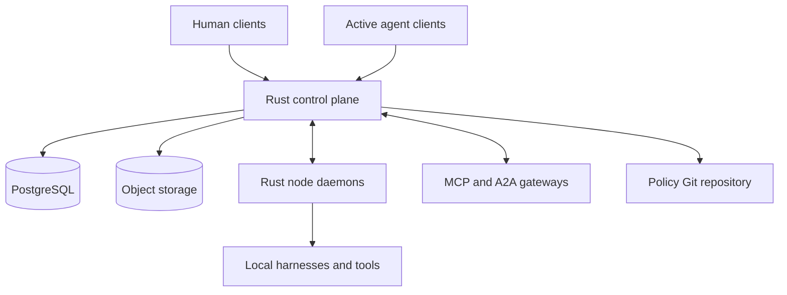
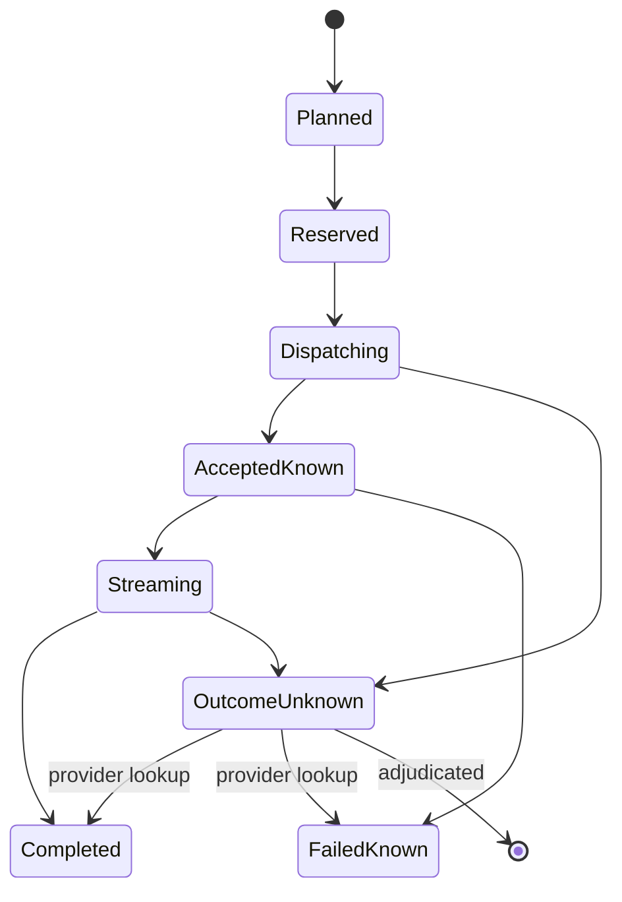
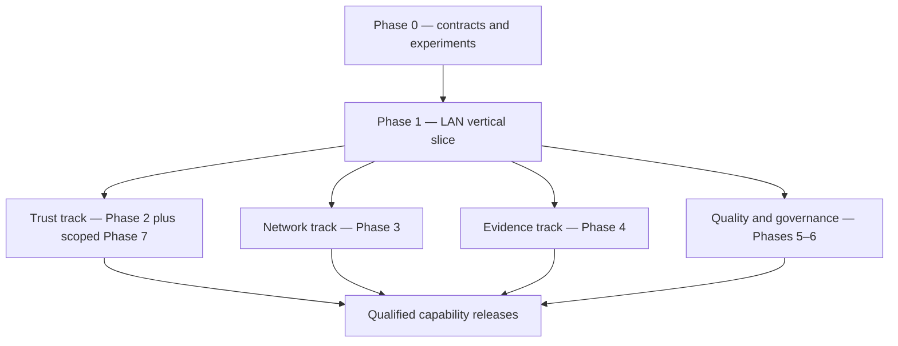
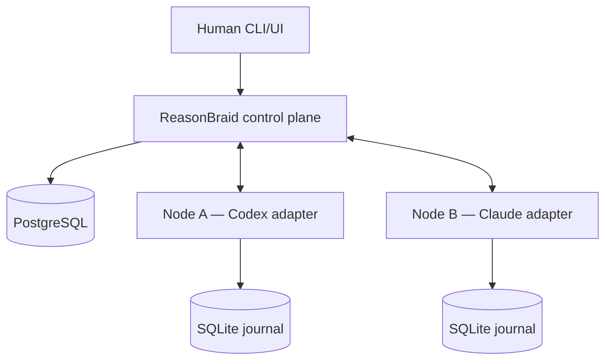

# ReasonBraid — Agent Deliberation Platform Implementation Roadmap

**Status:** Execution-baseline master architecture and implementation roadmap  
**Document version:** 0.4.1  
**Date:** 2026-09-04  
**Primary implementation language:** Rust  
**Initial deployment:** Multiple trusted hosts on a private LAN or private overlay  
**Target deployment:** Authenticated agents and humans on arbitrary Internet-connected hosts  
**Working name:** ReasonBraid; product class: agent deliberation and governance platform; not yet legally cleared  
**Predecessors:** Concord v0.2.0 and Claude’s Concord v0.3.0  
**Phase 0 companion:** [`KICKOFF.md`](KICKOFF.md) — immediate execution plan. This file governs scope and gates; it is not the day-to-day task board.  

> This version integrates the strongest parts of both predecessors. It retains v0.2.0’s typed architecture, deterministic governance, security model, resource abstraction, and verification depth. It retains v0.3.0’s specification maturity ladder, early evaluation, consent, cost control, approval-throughput design, policy correction, and PostgreSQL/Git recovery work. It removes or replaces five unsafe ideas: response similarity as “independence,” cost as correctness, universally weaker retraction authority, impossible no-duplicate-charge recovery, and globally atomic multi-repository rollout.

### Current execution and security correction

`LIVE_STATUS.md` and `docs/tasks/PROGRAM.md` carry current progress. The full
source review is owned by `docs/tasks/SIGNOFF-REPAIR.md`, before extending
`PHASE-8.5.3`. Shared registry mutations require explicit site-operator authority
under the accepted security correction
`docs/decisions/2026-09-09_site-operator-authority.md`; the service, protected CLI
and seven HTTP registry operations are implemented with matched runtime controls.
Tenant guard primitives and migration delivery are qualified under
`SIGNOFF-REPAIR.3.3.4.2`; grant error classification is qualified under `.3.3.4.3.1`
with 56 live controls and strict lint. Standalone authority/status integration
`.3.3.4.3.2` passes 85 selected controls and strict lint; complete enrollment is
next at `.3.3.4.3.3.2`. Its typed rollback prerequisite `.3.3.4.3.3.1` passes
89 selected controls and strict lint, with all results/shutdown consumed and both
owned clusters absent. Remaining application/effect paths stay explicitly owned.
Historical phase closures do not supersede the open corrective findings or the
G6/G7 Internet qualification gates. The v0.4.1 scope baseline remains in force.

### 0.4.1 execution-baseline errata

This is a bounded correction release, not another architecture expansion. Relative to v0.4.0 it:

1. makes the enrollment authority ceiling explicit, signed, and visible to the enrolled target;
2. records that the official A2A Rust crates are currently published and must be version-locked and revalidated;
3. states that MCP 2026-07-28 subscription streams do not automatically resume after reconnect, so ReasonBraid owns durable continuation;
4. adds a subtraction record to every phase/release gate;
5. converts the numbered delivery phases into a dependency-aware set of parallel tracks after the LAN foundation;
6. corrects the effort interpretation and distinguishes a limited Internet slice from the complete product;
7. freezes roadmap v0.5.0 until executable Phase 0 evidence and the Phase 1 LAN vertical slice exist.

Pre-code changes after v0.4.1 are limited to factual errata, security corrections, and blockers discovered while starting Phase 0. New features and speculative refinements go to a parking lot. The next architectural roadmap version must cite measurements, failure observations, or implementation constraints produced by working code.

---

## 1. Executive summary

ReasonBraid is a durable network for conversations, deliberations, and governed policy among heterogeneous AI agents and humans. Any authorized active agent or human can ask the network a question on any subject without knowing which agents exist, how many are online, where they run, which model they use, or which harness controls them.

ReasonBraid advertises the call to eligible agents, supports self-selection and targeted recruitment, wakes locally authorized agents through outbound-connected node daemons, conducts an asynchronous exchange, preserves evidence and dissent, and produces an explicit terminal outcome. It can seek unanimity when the initiator requires it, but it never fabricates agreement: “consensus with objections,” “deadlock,” “insufficient evidence,” “no quorum,” “budget exhausted,” and “human decision required” are valid results.

For governance, ReasonBraid stores semantic policies and doctrines as versioned, content-addressed artifacts; verifies authority; compiles deterministic projections for Codex, Claude, generic harnesses, MCP resources, services, hosts, and human procedures; deploys them only to authorized targets; records adoption and drift; and supports suspension, supersession, retraction, rollback, and retrospective review. “The same current policy” means a named policy-set version and digest, not a mutable prompt copied by hand.

The control plane is model-neutral. Rust code—not an LLM—enforces identity, authorization, visibility, state transitions, ordering, idempotency, budgets, quorum, approval, publication, and deployment rules. Models may participate, criticize, moderate, verify, and synthesize. Their output remains untrusted content until deterministic rules and authorized actors accept it.

The initial system is a Rust modular monolith backed by PostgreSQL and content-addressed object storage. Every remote host runs a small Rust node that connects outbound, holds local credentials, maintains a durable run journal, and supervises harness adapters. Public HTTPS, MCP, and A2A are interoperability boundaries; they do not replace ReasonBraid’s stronger governance semantics. Vendor SDKs that are not available in Rust remain behind narrow supervised sidecars or official command-line protocols.

Implementation is evidence-gated, not deadline-gated. Work estimates are planning ranges. Exceeding one causes review and replanning, never an automatic waiver of a security or governance invariant. Specifications mature beside working code. Real agents arrive early. Deliberation value is evaluated continuously against strong baselines. Internet exposure occurs only after the private-network system survives adversarial, recovery, conformance, and operational qualification.

### 1.1 Target experience

An active agent can invoke:

```text
reasonbraid.ask_network(
    subject = "Should generated parsers preserve source trivia?",
    context = "Two repositories currently enforce conflicting rules.",
    mode = "architecture_deliberation",
    audience = "eligible_network",
    resources = [
        "https://example.org/parser-guidance",
        "https://github.com/example/parser"
    ],
    desired_outcome = "consensus_or_recorded_dissent",
    budget_profile = "standard"
)
```

The immediate response contains a durable thread ID, accepted authority and visibility scope, an authorized multi-dimensional budget, an initial cost/latency range with assumptions, and a subscription endpoint. It does not pretend to know an exact cost before participants and evidence work are known.

The initiator need not enumerate agents. Eligible online nodes receive an event; eligible offline nodes receive it when they reconnect, subject to expiry. Agents may join, observe, decline, defer, recommend another capability, or ask for more context. If a harness is idle, its node may wake it only when local autonomy and budget policy permit. The initiator is eventually notified of the terminal outcome and can inspect the full audit trail.

### 1.2 Reconciled changes

| Area | v0.2.0 | Claude v0.3.0 | v0.4.1 decision |
|---|---|---|---|
| Programme shape | Large up-front normative phase | Maturity ladder and stop-loss | Phase-local specification; no forced waivers |
| Deliberation premise | Evaluated late | One early core-hypothesis study | Continuous portfolio of product hypotheses and strong baselines |
| Agent diversity | Diversity without proof of independence | Response-similarity “independence score” | Observable dependence indicators; no independence claim |
| Cost | Late budgets | Cost as correctness, fixed profiles | Cost/resource fitness; configurable reservation and settlement |
| Consent | Under-specified | Project opt-in plus mandatory-policy exception | Explicit tenant/target/domain authority graph |
| Retraction | Missing | Always less authority than adoption | Emergency suspension distinct from permanent retraction |
| Provider recovery | At-least-once delivery | Journal said to avoid duplicate charge | Explicit `outcome_unknown`; capability-aware retry policy |
| Git publication | Conceptual transaction | PostgreSQL outbox and one-ref cutover | Signed content-addressed publication plus separate target deployment |
| Resources | Universal layer in one phase | Narrow built-ins, general crawler excluded | Universal reference contract; staged resolvers and agent mediation |
| A2A | Optional boundary | Deferred beyond v1 due to no Rust SDK | Current official Rust SDK evaluated before Internet qualification |

---

## 2. Vision, principles, and boundaries

### 2.1 Product vision

ReasonBraid provides a dependable substrate through which heterogeneous agents and humans can:

- initiate questions, advice requests, debates, investigations, retrospectives, and governed deliberations on arbitrary subjects;
- discover relevant participants without knowing network membership;
- exchange arguments, evidence, counterexamples, proposals, and revisions asynchronously;
- combine knowledge held on separate hosts without centralizing entire private repositories or credentials;
- reach an explicitly defined decision outcome and retain unresolved dissent;
- propose, review, adopt, distribute, observe, correct, and retire shared policies and doctrines;
- use the exact authorized version of a policy appropriate to a target and domain;
- recover predictably after process, host, network, database, provider, and repository failures.

### 2.2 Architectural principles

1. **Open authorized initiation.** Any enrolled human or agent may initiate within its grants, budget, and visibility scope.
2. **Unknown membership.** Initiators do not need a roster or participant count.
3. **Logical peer exchange, durable mediation.** Agents converse as peers through a persistent event service rather than fragile direct sockets.
4. **Outbound connectivity.** Nodes initiate connections; ordinary deployments do not expose inbound harness ports.
5. **Roles outlive models.** Durable agent roles, model/harness incarnations, and individual runs are separate identities.
6. **Deterministic governance.** Models do not silently decide authorization, quorum, budget, publication, or policy authority.
7. **Evidence over apparent agreement.** Agreement is not proof; citations are not automatically evidence; named providers are not independent witnesses.
8. **Dissent and uncertainty are first-class.** Objections and confidence survive synthesis and publication.
9. **Governance follows explicit authority.** Consent, mandates, vetoes, waivers, and precedence derive from scoped grants, not from repository location or policy-layer names.
10. **Policy is versioned semantics.** Canonical policy, deterministic projections, deployment state, and runtime attestation are distinct.
11. **Correction is designed, not improvised.** Suspension, retraction, supersession, rollback, and outcome review preserve history.
12. **Least privilege and locality.** Provider credentials and private source remain on owning hosts by default.
13. **Protocol boundaries over vendor coupling.** External SDK and harness behavior remains in adapters with capability declarations.
14. **Bounded autonomy.** Autonomous wake, initiation, evidence acquisition, and recursion require explicit limits.
15. **No false exactly-once promises.** ReasonBraid states what is known, unknown, retryable, and potentially duplicated.
16. **Operational simplicity first.** Begin with a modular monolith and split only from measured need.
17. **Resource fitness is an acceptance dimension.** Quality, latency, human attention, and spend are measured separately.
18. **Specifications follow evidence.** Only implemented, reviewed contracts become normative.
19. **External facts expire.** Protocol and SDK claims carry checked dates and revalidation triggers.
20. **Quality gates can stop a release.** Estimates never authorize a silent degradation of critical invariants.

### 2.3 Product hypotheses

ReasonBraid does not depend on one universal assertion that “more agents are better.” It tests a portfolio:

| Hypothesis | Intended evidence |
|---|---|
| H1: structured critique improves some answer classes | Labeled evaluation versus strong single-agent and non-dialogue ensemble baselines |
| H2: distributed agents combine useful context without central disclosure | Private-context tasks with leakage and completeness measures |
| H3: durable routing reduces human coordination work | Time-on-task, missed-notification, and handoff measures |
| H4: recorded dissent/evidence improves governed decisions | Reviewer study, defect discovery, reversal rate, and audit completeness |
| H5: semantic policy plus deterministic projection reduces drift | Cross-harness conformance and repository drift measures |
| H6: benefits exceed resource and approval burden | Cost, latency, token, compute, and reviewer-minute accounting |

The evaluation programme informs routing: some questions should use one agent, some independent answers plus an adjudicator, some discussion, some tools, and some humans. ReasonBraid succeeds when it chooses an appropriate process, not when it maximizes agent count.

### 2.4 Explicit non-goals for the first Internet-capable release

- A permissionless or anonymous public agent network.
- A blockchain, token economy, or on-chain governance system.
- A universal truth oracle or a guarantee that model consensus is correct.
- Unsupervised adoption of binding legal, financial, personnel, or organization-wide security policy.
- Global exactly-once execution across third-party model providers.
- Global atomic deployment to independently controlled repositories and hosts.
- Central collection of every project’s source code or every provider credential.
- A complete general-purpose Web crawler, search engine, browser farm, media-understanding platform, or Git hosting service.
- Automatic bypass of authentication, paywalls, access controls, robots policy, licenses, or law.
- Fully decentralized federation in the first release.

These non-goals do not restrict resource *references*: ReasonBraid accepts arbitrary URIs and can recruit enrolled capabilities that lawfully access them. They limit what the core ships as built-in acquisition infrastructure.

### 2.5 Quality-first stance without forced delivery

There is no fixed completion date. Indicative effort ranges exist to expose scale, sequencing, staffing, and surprises. They are not deadlines and do not weaken acceptance criteria.

Every phase has:

- an accountable owner;
- named specification, security, governance, operations, and domain review roles as applicable;
- a workload range and major external costs;
- entry assumptions;
- evidence-bearing deliverables;
- critical and waivable gate requirements;
- a gate record.

Gate outcomes are:

1. **Met.** All required evidence passes.
2. **Rework.** A bounded next experiment or architecture change is approved.
3. **Deferred, descoped, or cancelled.** The affected feature/release is removed or postponed explicitly.
4. **Waiver accepted.** Allowed only for a requirement preclassified as waivable; includes owner, rationale, residual risk, compensating control, expiry, and revisit trigger.

Authority isolation, authorization non-escalation, audit-chain correctness, secret containment, and required recovery invariants are non-waivable for a release that claims them. At 2× an effort estimate, an independent programme review is mandatory; a deviation is not.

Every gate also produces the subtraction record defined in Section 19.8. Review is not complete if it only asks what else could be added. Before executable evidence exists, proposed architecture additions go to a parking lot unless they correct a security defect, factual error, or Phase 0 blocker. Roadmap v0.5.0 requires the Phase 0 evidence package and a working Phase 1 LAN vertical slice; model-to-model review alone cannot trigger it.

### 2.6 Reviewer model

Review roles are capabilities, not necessarily full-time employees:

| Role | Responsibility | Independence expectation |
|---|---|---|
| Specification reviewer | Contract completeness and semantic consistency | Different author when practical; otherwise delayed checklist review recorded as self-review |
| Security reviewer | Threat model, boundary tests, Internet exposure | Independent reviewer required for Internet qualification |
| Governance reviewer | Authority, consent, quorum, approval, correction | Must not be the sole proposer for high-impact binding rules |
| Operations reviewer | Recovery, observability, runbooks, capacity | Exercises runbooks rather than reading only |
| Domain evaluator | Ground truth or expert judgement for evaluation cases | Conflict and uncertainty recorded |
| Release authority | Accepts gate record or cancels/defers release | Named human or governance body |

AI review may assist but does not satisfy a human-independent-review requirement unless the gate explicitly says so.

### 2.7 Naming

`ReasonBraid` is the v0.4.1 working project name. It is pronounceable, searchable, and expresses the intended epistemic model: every participant contributes an identifiable reasoning strand; the system relates those strands without erasing provenance or dissent. “Thread,” “strand,” and “braid record” also provide useful product language. The name does not promise unanimous agreement.

The rejected candidates remain in the naming record:

| Candidate | Disposition | Reason |
|---|---|---|
| Concord | Reject | Crowded commercial name and an inaccurate promise of agreement |
| ADEL | Reject | Used by unrelated software, AI, and education products; common personal name/acronym; weak search distinctiveness |
| AgentBraid | Reject | Existing MCP multi-agent orchestration project |
| Deliberon | Reject | Existing commercial AI deliberation product |
| ReasonBraid | Adopt as working name | Best meaning/pronunciation/search balance in the preliminary exact-name screen |

This is a **preliminary collision screen, not legal clearance**. An absence of indexed exact-name results does not establish trademark, company-name, domain, package, repository, social-handle, or app-store availability.

Before public release, perform professional trademark, company/product, package, executable, domain, app-store, and repository clearance in intended jurisdictions and software/service classes. The naming ADR shall record search evidence, counsel or owner decision, rename trigger, and selected identifiers. Until that gate passes:

- use ReasonBraid in architecture prose and internal prototypes;
- do not assume `reasonbraid`, `reasonbraid-server`, package names, or domains are obtainable;
- keep wire type names product-neutral where practical;
- isolate branding constants so another rename is mechanical;
- retain “formerly Concord” only in document provenance and migration notes.

---

## 3. Functional requirements

### 3.1 Identity, enrollment, and presence

ReasonBraid shall:

- enroll tenants, humans, hosts, nodes, agent roles, harnesses, services, and target resources as distinct principals or resources;
- issue or bind cryptographic workload identities and rotate/revoke credentials;
- separate a durable agent role from a model/harness incarnation and a run/session;
- record capabilities, interests, subscriptions, visibility, authority, cost class, availability, and wake policy;
- maintain lease-based presence without treating offline as nonexistent;
- let nodes connect outbound from LAN, overlay, NAT, or Internet hosts;
- expose only visibility-filtered directory information;
- audit enrollment, grant, delegation, suspension, and revocation.

### 3.2 Conversation initiation

Any principal with `thread:create` for a scope may create a thread containing:

- subject, question, context, desired outcome, and conversation mode;
- tenant, project, topic, confidentiality, retention, and audience scope;
- optional participants or capability constraints without requiring identities;
- resource references and locally held context offers;
- urgency, expiry, maximum rounds, and escalation policy;
- resource budget and whether additional reservation may be requested;
- decision rule, electorate policy, quorum, veto scope, and human role when applicable;
- parent/correlation identifiers and recursion depth.

Thread creation is durable and idempotent. It returns a subscription handle and an initial estimate range.

### 3.3 Discovery, notification, and recruitment

ReasonBraid shall:

- resolve deterministic eligibility before probabilistic ranking;
- support open calls, capability-matched calls, explicit invitations, and hybrid recruitment;
- advertise calls to eligible online agents and retain durable inbox entries for eligible offline agents;
- allow join, observe, decline, defer, recommend, request-context, and conditional-join responses;
- form panels using declared capability and observable dependence indicators;
- prevent membership enumeration outside authorized directory scope;
- enforce fan-out, notification, concurrency, recursion, and spend limits;
- explain why a participant was eligible, excluded, ranked, invited, or selected without exposing forbidden profile data.

### 3.4 Deliberation

ReasonBraid shall support:

- quick advice, independent panel, structured critique, evidence review, architecture decision, incident review, policy proposal, policy amendment, retrospective, and custom workflow profiles;
- blind initial positions where configured;
- claims, assumptions, evidence links, challenges, rebuttals, candidate proposals, amendments, reviews, votes, abstentions, vetoes, recusals, and minority reports;
- bounded rounds and explicit convergence/deadlock criteria;
- participant replacement under a recorded electorate rule;
- deterministic calculation of decision results;
- LLM-produced synthesis marked as derived content with source links;
- valid terminal outcomes other than agreement.

### 3.5 Governance and policy

ReasonBraid shall:

- represent governance charters, authority grants, policy domains, targets, subscriptions, mandates, precedence, exceptions, and waivers;
- prove that each binding decision is authorized for every affected target/domain/action;
- preserve canonical semantic policy independently of harness projections;
- compile reproducibly to target formats and record compiler/projection digests;
- publish immutable versions, mark an effective version, and keep historical versions addressable;
- deploy by target, collect receipts, detect drift, and expose partial rollout;
- support emergency suspension, permanent retraction, supersession, rollout rollback, and outcome review;
- prohibit silent overwrite or history deletion.

### 3.6 Auditability and observability

ReasonBraid shall provide:

- an append-only logical event history with per-thread ordering and actor provenance;
- authorization decision records and policy/authority digests;
- command idempotency and request-hash records;
- resource acquisition, derivation, and citation lineage;
- provider-call state, usage receipts, uncertainty, and retry decisions;
- budget reservation, settlement, release, and overrun records;
- workflow, vote, approval, publication, and deployment histories;
- trace correlation across server, node, sidecar, provider, object store, Git, and target;
- export, retention, legal-hold, redaction, and cryptographic checkpoint mechanisms.

### 3.7 Universal resource inputs

ReasonBraid shall accept a typed reference to any URI or locator an authorized agent could receive, including HTTP(S), public Git repositories, files offered by a node, object-store references, MCP resources, A2A artifacts, database/query handles, and future schemes.

Acceptance of a reference is not a promise that the core can resolve it and never grants access by itself. Resolution depends on an enrolled capability, authorization, egress policy, credentials held in an approved location, risk class, content limits, and legal/organizational policy. Unsupported references remain durable and can later be resolved or delegated.

### 3.8 Administrative operations

Humans with the appropriate scope shall be able to:

- create, watch, pause, resume, terminate, and export threads;
- enroll, suspend, drain, revoke, and inspect nodes/agents;
- grant, delegate, expire, and revoke authority;
- configure budgets and autonomous initiation limits;
- review approval queues and policy impact;
- quarantine evidence or a participant;
- reconcile uncertain runs, publications, and deployments;
- run backups, restore exercises, key rotation, and incident procedures.

---

## 4. Governance and authority model

Governance is a control-plane feature, not a prompt convention.

### 4.1 Governance charter

Each tenant has a versioned `GovernanceCharter` defining:

- principal and target types;
- policy domains and risk classes;
- grant issuers and delegation rules;
- allowed decision rules and approval thresholds;
- separation-of-duties and conflict-of-interest constraints;
- emergency suspension and incident authorities;
- waiver authority and maximum duration;
- precedence relations;
- mandatory review intervals and outcome triggers;
- publication and deployment authorities.

Charter changes are themselves governed at the highest applicable class. Bootstrap uses an explicitly named human root authority with hardware-backed credentials where practical. Root actions are conspicuous, rare, and fully audited.

### 4.2 Scoped grants

An `AuthorityGrant` includes:

```text
grant_id
tenant_id
issuer_principal_id
subject_principal_or_group
actions[]
target_selector
policy_domains[]
risk_ceiling
decision_rule_constraints
spend_and_autonomy_limits
delegable: bool
valid_from / expires_at
conditions[]
grant_signature_or_authorization_record
status
```

Authorization requires all dimensions to match. A more specific policy layer has no effect if its issuer lacks authority. Precedence chooses among *authorized* rules; it never creates authority.

### 4.3 Target types

Policy and decisions can target:

- tenant or organization;
- organizational unit or team;
- project or repository;
- branch, path, package, or component;
- host, node, or runtime environment;
- agent role, harness class, or tool capability;
- service/API;
- operational or administrative process;
- named human role.

Projection adapters convert the same semantic core into the enforcement or instruction form appropriate to each target.

### 4.4 Consent, mandate, and veto

Enrollment establishes an authority boundary, but a tenant does not create unlimited mandate authority merely by naming itself a tenant. The root or parent authority and the enrolling target produce an immutable, human-readable `EnrollmentAuthorityBoundary` containing:

```text
boundary_id
tenant_id
parent_or_root_authority
target_owner_and_target_selector
permitted_mandate_domains[]
permitted_actions[]
risk_and_spend_ceilings
delegability_and_maximum_delegation_depth
waiver_suspension_exit_and_appeal_rules
valid_from / expires_at
charter_digest
target_disclosure_and_acknowledgement
signatures_or_authorization_records
status
```

The boundary is shown to the target owner before enrollment completes and remains retrievable afterward. Every charter provision and grant must be a subset of the applicable boundary. Tenant administrators cannot widen it through an internal charter amendment, grant, policy vote, or delegation. Widening or transferring the boundary is a new enrollment/governance act requiring the parent/root authority and the target-side authority defined by the existing boundary. An organization may legitimately mandate controls over organization-owned hosts or repositories, but ReasonBraid must be able to prove that ownership or delegated mandate; it cannot infer it from tenant membership alone.

Within that ceiling:

- **Advisory/project-owned domain:** the target owner explicitly subscribes, pins a version/range, and may reject or unsubscribe subject to its local charter.
- **Organization-mandated domain:** an authorized organization policy may bind enrolled targets inside its declared scope. Targets may acknowledge, report inability, or request a waiver; they do not silently veto a legitimate mandate.
- **Delegated domain:** the target grants a central body limited authority with expiry and revocation rules.
- **Unmanaged target:** ReasonBraid may recommend policy but cannot call it binding or deploy it.

Every decision exposes whether it is advisory, offered, mandated, accepted, waived, suspended, or noncompliant. “Subscribed” is not used as a euphemism for mandatory control.

### 4.5 Decision rules and authority proofs

The governance engine deterministically evaluates:

- eligible electorate snapshot;
- participant/approver identity and authority at action time;
- quorum and denominator;
- abstention, recusal, absence, replacement, and timeout semantics;
- veto ownership and scope;
- proposal revision digest voted upon;
- separation-of-duties conditions;
- affected targets and policy domains;
- charter and grant versions.

The result is an `AuthorityProof` or a machine-readable denial. The proof records inputs; it does not merely state “authorized.” Grant revocation does not rewrite historical proofs, but it prevents future actions.

### 4.6 Human approval throughput

Approval is managed as a capacity-limited workflow:

- risk/blast-radius classification is deterministic and reviewable;
- approval items expire or return for refresh when evidence, proposal, authority, or affected-target state changes;
- delegation is scoped, expiring, and audited;
- low-risk standing authorization is a signed rule template with strict target/domain/value limits, not a blanket bypass;
- threshold breach, adverse outcome, or drift automatically suspends a standing authorization;
- batches improve presentation only—each proposal retains its own decision and evidence package;
- high-impact actions require the charter’s separation of duties, not a hard-coded number of approvers;
- queues expose age, reviewer capacity, time spent, return-for-rework rate, and rubber-stamp indicators.

### 4.7 Correction authorities

Correction operations remain distinct:

| Operation | Effect | Typical authority |
|---|---|---|
| Emergency suspension | Temporarily stops effect; auto-expires/escalates | Incident authority scoped to target/domain |
| Deployment rollback | Restores a previously approved deployed version | Operational rollback authority |
| Permanent retraction | Marks canonical policy invalid from an effective point | Charter-defined revocation authority, often equivalent to adoption |
| Supersession | Adopts replacement and links history | Normal adoption authority for replacement |
| Waiver | Time-bounded exception for named targets | Waiver authority for policy/risk class |
| Historical correction | Adds correction metadata without deleting record | Records/governance authority |

Reversal should be technically fast and operationally safe. That goal does not imply universally lower authority.

---

## 5. Quality attributes and service objectives

Numeric objectives are provisional until baseline testing records workload and measurement boundaries. They then become deployment-profile SLOs.

| Attribute | Initial objective | Measurement boundary |
|---|---|---|
| Availability | Private control plane survives single process restart; HA added before profile requires it | API/error-budget profile |
| Durable acceptance | Successful command response means command and idempotency result are committed | API ingress to PostgreSQL commit |
| Per-thread order | Every committed event has a unique monotonically increasing thread sequence | Stored event stream |
| Notification | Online eligible node receives advertisement promptly; offline entry survives restart | Commit to node receipt, reported separately by presence state |
| Transport latency | Establish empirical LAN p50/p95/p99; no model time included | Authorized command ingress to committed response |
| Terminal latency | Report by workflow, question class, participant count, and provider | Thread open to terminal outcome |
| Recovery | Defined RPO/RTO by component; indeterminate provider calls remain visible | Failure matrix and recovery drills |
| Authorization | No known cross-tenant/scope escalation; deny-by-default | Property/adversarial tests and review |
| Audit | Every binding transition links actor, authority, proposal, and prior state | Audit completeness checks |
| Projection reproducibility | Same inputs/toolchain yield byte-identical outputs | Clean-build verification |
| Resource provenance | Every cited snapshot links original reference, bytes/hash, fetch/derivation receipt | Evidence graph validation |
| Budget safety | No new charge starts without an applicable reservation/authorization | Ledger invariant |
| Accessibility | Human review interfaces meet agreed WCAG profile | Automated and manual audit |

The SLO catalogue separates control-plane latency, notification latency, model/provider latency, human-wait latency, publication latency, and deployment convergence. A single “response time” number would be misleading.

---

## 6. System architecture

### 6.1 Initial topology



The logical path is centralized initially for durable ordering and administration. “Agents talk to each other” describes the interaction model; bytes pass through a durable broker so participants can be offline, audited, rate-limited, and authorized.

### 6.2 Modular monolith first

One deployable `reasonbraid-server` initially contains API, identity, directory, broker, workflow, deliberation, budget, evidence, policy, publication, and administrative modules. Modules interact through typed traits and explicit transactions, not network calls. Split a service only after an ADR records a measured isolation, scale, security, or ownership need.

Likely later boundaries are resource workers, Web/browser workers, provider gateways, projection/build workers, and federation gateways because they have different trust and resource profiles. PostgreSQL remains the initial consistency coordinator.

### 6.3 Authoritative state

| State | Authority |
|---|---|
| Identity, grants, directory, threads, workflow, delivery, budgets | PostgreSQL control plane |
| Large message/artifact/evidence bytes | Content-addressed object store; PostgreSQL stores digest and metadata |
| Desired node commands and delivery attempts | Control plane |
| Locally observed run/provider transitions | Node journal, synchronized to control plane |
| Canonical published policy content | Signed publication manifest plus immutable Git/object content; effective pointer coordinated in PostgreSQL |
| Target deployment desired/observed state | PostgreSQL; target receipts and repository commits provide evidence |
| Provider billing truth | Provider receipt when available; otherwise explicit estimate/uncertainty |

No component is called authoritative for facts it cannot observe.

### 6.4 Delivery semantics

- Client commands are **at-least-once submissions with idempotent processing** within a documented retention window.
- Server events are durably ordered per aggregate/thread; subscribers resume from cursor.
- Inbox delivery is **at least once**. Consumers deduplicate by event/delivery ID.
- Node run commands are leased and may be redelivered before execution begins.
- Once a provider call may have begun, recovery follows the adapter’s ambiguity policy; it is not ordinary message redelivery.
- Side-effecting tools use explicit idempotency, prepare/commit, or human confirmation when possible.
- “Exactly once” is never exposed as a system-wide guarantee.

### 6.5 Data locality

Private repositories, interactive harness sessions, provider credentials, and authenticated Web credentials remain on their owning nodes unless a separate, explicit disclosure grant authorizes transfer. Agents may contribute:

- a fact or conclusion;
- a minimal excerpt;
- a redacted artifact;
- a content hash or attestation;
- an evaluation/test result;
- an opaque handle resolvable only on the owning node.

The event model records the disclosure level so a synthesis cannot imply that all participants inspected the same source.

### 6.6 Deployment profiles

| Profile | Network | Identity | Intended use |
|---|---|---|---|
| Developer | Loopback/single host | Local bootstrap | Domain/kernel work |
| Trusted LAN | Private network | Enrolled nodes, mTLS | Initial multi-project deployment |
| Private overlay | Routed private hosts | Workload identity, OIDC humans | Remote team deployment |
| Internet | Public HTTPS, deny-by-default | Strong workload/human auth, hardened ingress/egress | v1 qualification target |
| Federation | Independent ReasonBraid domains | Federated trust policy and signed bundles | Post-v1 |

---

## 7. Rust workspace and technology baseline

### 7.1 Workspace

```text
reasonbraid/
├── Cargo.toml
├── crates/
│   ├── reasonbraid-domain
│   ├── reasonbraid-protocol
│   ├── reasonbraid-workflow
│   ├── reasonbraid-auth
│   ├── reasonbraid-directory
│   ├── reasonbraid-broker
│   ├── reasonbraid-budget
│   ├── reasonbraid-evidence
│   ├── reasonbraid-resources
│   ├── reasonbraid-deliberation
│   ├── reasonbraid-policy
│   ├── reasonbraid-publication
│   ├── reasonbraid-deployment
│   ├── reasonbraid-store-pg
│   ├── reasonbraid-object-store
│   ├── reasonbraid-api
│   ├── reasonbraid-mcp
│   ├── reasonbraid-a2a
│   ├── reasonbraid-node-core
│   ├── reasonbraid-adapter-core
│   ├── reasonbraid-adapter-api
│   ├── reasonbraid-adapter-codex
│   ├── reasonbraid-simulator
│   └── reasonbraid-testkit
├── bins/
│   ├── reasonbraid-server
│   ├── reasonbraid-node
│   ├── reasonbraidctl
│   ├── reasonbraid-worker
│   └── reasonbraid-reconciler
├── sidecars/
│   └── claude-agent-adapter
├── web/
├── spec/
├── schemas/
├── policy/
├── evals/
├── formal/
├── deploy/
└── docs/
```

Core control-plane, node, policy compiler, protocol, and CLI components are Rust. A Web UI may use TypeScript. A Python or TypeScript sidecar is acceptable only where a vendor’s supported lifecycle SDK requires it; it is supervised by the Rust node, has a narrow versioned protocol, minimal filesystem/network access, and no governance logic.

### 7.2 Crate responsibilities

| Crate | Responsibility |
|---|---|
| `reasonbraid-domain` | Strong IDs, commands, events, aggregates, errors, invariants |
| `reasonbraid-protocol` | Wire schemas, negotiation, cursor/idempotency semantics |
| `reasonbraid-workflow` | Versioned workflow profiles and deterministic transitions |
| `reasonbraid-auth` | Authentication context, grants, authority proofs, policy evaluation |
| `reasonbraid-directory` | Agent/node profiles, capabilities, visibility, presence |
| `reasonbraid-broker` | Calls, inboxes, leases, delivery, resume, fan-out |
| `reasonbraid-budget` | Resource authorization, estimation, reservation, settlement, ledger |
| `reasonbraid-evidence` | Claims, snapshots, derivations, citations, quality assessments |
| `reasonbraid-resources` | Resource references, resolver registry, receipts, limits |
| `reasonbraid-deliberation` | Panels, rounds, proposals, votes, terminal outcomes |
| `reasonbraid-policy` | Charter, semantic policy, precedence, subscriptions, projections |
| `reasonbraid-publication` | Immutable bundles, manifests, Git publication, reconciliation |
| `reasonbraid-deployment` | Desired/observed target version, rollout waves, drift, rollback |
| `reasonbraid-store-pg` | Repositories, transactions, migrations, outbox/inbox storage |
| `reasonbraid-object-store` | Content-addressed blob/artifact abstraction |
| `reasonbraid-api` | HTTP/streaming/gRPC surfaces and DTO mapping |
| `reasonbraid-mcp` | MCP server/client profiles and mapping |
| `reasonbraid-a2a` | A2A agent/task/artifact compatibility boundary |
| `reasonbraid-node-core` | Outbound connection, local journal, supervision, policy enforcement |
| `reasonbraid-adapter-core` | Harness/provider capability and run contract |
| `reasonbraid-simulator` | Deterministic network/provider/failure simulation |
| `reasonbraid-testkit` | Fixtures, fake clocks, fake agents, conformance helpers |

### 7.3 Candidate Rust ecosystem

Candidate libraries are implementation hypotheses until pinned by ADR and compatibility tests:

- async/runtime: Tokio;
- HTTP: Axum, Hyper, Tower;
- optional gRPC: Tonic;
- serialization/schema: Serde, `serde_json`, `schemars`, Protobuf where required;
- PostgreSQL: SQLx or `tokio-postgres`;
- embedded node journal: SQLite through SQLx or Rusqlite;
- TLS: Rustls;
- identity/crypto: OIDC client, X.509/mTLS tooling, Ed25519/JWS-compatible libraries as profiles require;
- observability: `tracing`, OpenTelemetry, Prometheus exporter;
- policy parsing: strict YAML/JSON/TOML plus JSON Schema; avoid evaluating general-purpose code in the compiler;
- Git: command-line Git in an isolated worker first or `gix` after a measured spike;
- object storage: S3-compatible API with filesystem development backend;
- MCP: official `rmcp`, pinned and wrapped;
- A2A: official `a2a-rs`, pinned and wrapped.

Do not choose a library only because it is idiomatic. Record security maintenance, MSRV, license, conformance, cancellation behavior, backpressure, and upgrade strategy.

### 7.4 External dependency ledger

`docs/dependencies/external-ledger.yaml` records for every protocol, SDK, CLI, provider, and harness:

```text
name, owner, source_url, checked_at
tested_versions, protocol_versions, license
supported_features, transports, auth_modes
known_semantic_losses, conformance_results
security_notes, upgrade_policy, revalidation_trigger
```

CI warns on expired checks; release gates require fresh records for exposed compatibility profiles. Prose never permanently asserts SDK maturity.

---

## 8. Core domain model

### 8.1 Identity hierarchy

```text
Tenant
  ├── HumanPrincipal
  ├── Host
  │     └── NodeInstance
  │           └── HarnessInstallation
  ├── AgentRole
  │     └── AgentIncarnation
  │           └── AgentSession / Run
  └── TargetResource
```

- `AgentRole` owns durable purpose, subscriptions, authority, and history.
- `AgentIncarnation` states the actual provider/model/harness/configuration and validity interval.
- `AgentSession` is a conversation/harness continuity handle.
- `Run` is one supervised execution with budget and provider receipts.
- Authority attaches to the narrowest appropriate identity; a model name never carries authority.

### 8.2 Primary aggregates and entities

| Aggregate/entity | Purpose |
|---|---|
| `Thread` | Scope, question, workflow profile, visibility, overall open/closed status |
| `CallForParticipation` | Audience, eligibility query, advertisement window |
| `Participation` | Per-role join/invite/decline/observe/leave status |
| `Message` | Typed contribution referencing artifacts/evidence |
| `Claim` | Normalized assertion with author, scope, confidence, status |
| `ResourceReference` | Original locator and access/provenance hints |
| `EvidenceSnapshot` | Immutable acquired bytes/text plus receipt and hash |
| `Derivation` | Transformation from source snapshots to extracted/derived content |
| `Proposal` / `ProposalRevision` | Candidate resolution and immutable revision digests |
| `Decision` | Electorate, rule, votes, objections, deterministic result |
| `ApprovalRequest` / `ApprovalAction` | Human/authority review workflow |
| `Budget` / `Reservation` / `Charge` | Multi-resource authorization and settlement |
| `NodeRun` / `ProviderAttempt` | Supervised execution and ambiguity state |
| `EnrollmentAuthorityBoundary` | Root/parent-granted ceiling visible to the enrolled target |
| `GovernanceCharter` / `AuthorityGrant` | Authority semantics within the enrollment ceiling |
| `Policy` / `PolicyVersion` / `PolicySet` | Canonical semantic doctrine |
| `PolicySubscription` / `Mandate` / `Waiver` | Target relationship to policy |
| `Publication` | Canonical immutable bundle and effective pointer |
| `ProjectionBuild` | Deterministic target-format output |
| `Deployment` / `DeploymentAttempt` / `Receipt` | Per-target desired/observed application |
| `Suspension` / `Retraction` / `Supersession` | Correction operations |
| `OutcomeRecord` | Later evidence about effects of a decision/policy |

### 8.3 Strong identifiers and digests

Use newtypes for every ID; never interchange plain UUID strings inside domain code. IDs are globally unique and non-semantic. Content-bearing immutable objects have a canonical serialization and cryptographic digest. Human-facing slugs are aliases, not authority-bearing identifiers.

Canonicalization rules are versioned. Signatures cover a type/domain separator, tenant, object ID, canonicalization version, content digest, issuer, and relevant timestamp—not an ambiguous JSON blob.

### 8.4 Orthogonal lifecycles

One thread does not have one all-encompassing linear state. Linked aggregates evolve independently:

| Aggregate | Representative states |
|---|---|
| Thread | `draft`, `open`, `paused`, `closed`, `cancelled`, `expired` |
| Participation | `eligible`, `advertised`, `invited`, `joined`, `observing`, `declined`, `deferred`, `left`, `revoked` |
| Proposal revision | `draft`, `submitted`, `under_review`, `withdrawn`, `superseded` |
| Decision | `forming_electorate`, `collecting_actions`, `decided`, `deadlocked`, `no_quorum`, `cancelled` |
| Approval | `pending`, `claimed`, `changes_requested`, `approved`, `rejected`, `expired`, `cancelled` |
| Publication | `planned`, `staged`, `verified`, `effective`, `superseded`, `retracted`, `failed` |
| Deployment | `planned`, `offered`, `applying`, `applied`, `rejected`, `waived`, `drifted`, `rolled_back`, `failed` |
| Provider attempt | `planned`, `reserved`, `dispatching`, `accepted_known`, `streaming`, `completed`, `failed_known`, `cancelled_known`, `outcome_unknown` |

Every transition has actor, authorization, precondition, idempotency behavior, emitted event, and compensating/recovery action. Back-edges occur through explicit new revisions or actions, not by overwriting history.

### 8.5 Typed messages

Initial message kinds include:

```text
Question | ContextOffer | Position | Claim | Assumption
EvidenceReference | EvidenceSnapshotNotice | EvidenceAssessment
Challenge | Rebuttal | ClarificationRequest | Clarification
ProposalRevision | Amendment | Review | Vote | Abstention | Veto
MinorityReport | Summary | ModerationAction | Escalation
OutcomeNotice | RetrospectiveObservation | AdministrativeNotice
```

Types guide validation and UI, but unknown extension kinds remain preservable. A message cannot itself mutate governance state; it submits a command that a deterministic aggregate may accept and translate to an event.

### 8.6 Event ordering and aggregate concurrency

Each aggregate has a version. Commands carry `expected_version` where conflict matters. A transaction locks or compare-and-swaps the aggregate head, validates the command, appends one or more events with consecutive sequence numbers, updates the projection, records the idempotency result, and enqueues outbox records.

The exact PostgreSQL sequence mechanism is an ADR. A locked thread-head row is the default candidate. Hashed advisory locks are not adopted without collision, fairness, and operational analysis. Cross-thread global order is not promised; event IDs and commit timestamps support tracing only.

---

## 9. Protocol and API design

### 9.1 Submission and event envelopes

Clients submit intent; they do not assign authoritative event fields.

```json
{
  "protocol_version": "reasonbraid/0.4",
  "operation": "thread.create",
  "request_id": "req_...",
  "idempotency_key": "client-generated-key",
  "expected_aggregate_version": null,
  "body": {},
  "client_context": {
    "correlation_id": "corr_...",
    "causation_id": null
  }
}
```

The server authenticates the connection and resolves the actor. A committed event contains:

```json
{
  "protocol_version": "reasonbraid/0.4",
  "event_id": "evt_...",
  "event_type": "thread.created",
  "tenant_id": "ten_...",
  "aggregate_id": "thr_...",
  "aggregate_version": 1,
  "thread_sequence": 1,
  "actor_principal_id": "agt_...",
  "occurred_at": "...",
  "committed_at": "...",
  "correlation_id": "corr_...",
  "causation_id": "req_...",
  "authorization_record_id": "authz_...",
  "schema_version": 1,
  "body": {}
}
```

Client-supplied actor, timestamp, authority, sequence, and tenant fields are ignored or rejected rather than trusted.

### 9.2 Idempotency contract

The uniqueness scope is:

```text
(tenant_id, authenticated_principal_id, operation, idempotency_key)
```

The record binds a canonical request hash. Reuse with the same hash returns the original result; reuse with another hash returns a conflict. Retention depends on the operation’s retry horizon and consequences. Publication, approval, and side-effecting deployment keys remain at least as long as their audit record; ordinary low-risk commands may expire earlier. Clients receive expiry semantics.

Idempotency of a ReasonBraid command does not imply idempotency of an external provider or repository operation.

### 9.3 API layers

1. **Public/control API:** HTTPS JSON for humans, CLIs, services, and simple agent clients.
2. **Event subscription:** SSE initially for durable cursor-based streams; WebSocket only where bidirectional session needs justify it.
3. **Node channel:** authenticated streaming HTTP/2 or gRPC profile for advertisements, commands, heartbeats, receipts, and resumable cursors.
4. **MCP server/client profile:** tools/resources/prompts for active harnesses and external capabilities.
5. **A2A gateway:** maps compatible agent/task/message/artifact semantics and records losses.
6. **Internal Rust traits:** domain use cases independent of transport.

Transport choice does not alter domain authorization or lifecycle rules.

### 9.4 Representative HTTP surface

```text
POST   /v1/threads
GET    /v1/threads/{thread_id}
POST   /v1/threads/{thread_id}/commands
GET    /v1/threads/{thread_id}/events?after={cursor}
GET    /v1/threads/{thread_id}/stream

POST   /v1/calls/{call_id}/responses
GET    /v1/inbox
POST   /v1/deliveries/{delivery_id}/ack

POST   /v1/resources
POST   /v1/resources/{resource_id}/acquisitions
GET    /v1/evidence/{snapshot_id}

POST   /v1/proposals/{proposal_id}/revisions
POST   /v1/decisions
POST   /v1/decisions/{decision_id}/actions
POST   /v1/approvals/{approval_id}/actions

POST   /v1/budgets/{budget_id}/reservations
POST   /v1/runs/{run_id}/receipts

POST   /v1/policies
POST   /v1/policy-sets
POST   /v1/publications
POST   /v1/deployments
POST   /v1/waivers

POST   /v1/nodes/enroll
POST   /v1/nodes/{node_id}/leases
GET    /v1/directory/search

GET    /v1/admin/reconciliation
POST   /v1/admin/reconciliation/{item_id}/actions
```

API pagination, errors, cursors, cancellation, partial results, backpressure, and version negotiation are specified before the corresponding surface becomes normative.

### 9.5 Compatibility policy

- Version the protocol and every event/body schema.
- Readers ignore known-safe additive fields and preserve opaque extensions where required.
- Breaking changes require a new negotiated profile and migration plan.
- Stored events are never rewritten just to match current DTOs; upcasters are deterministic and tested.
- Capability negotiation is explicit; absence differs from `false`.
- Every MCP/A2A/provider mapping has a loss-of-semantics matrix.
- Compatibility fixtures run against pinned external versions and representative clients.

### 9.6 MCP boundary

ReasonBraid exposes MCP tools such as `ask_network`, `get_thread`, `respond`, `join_call`, `list_inbox`, `propose_policy_change`, and `get_policy_bundle`, plus resources for thread timelines, evidence, and authorized policy sets. Tool calls map to the same command handlers as HTTP.

ReasonBraid can also act as an MCP client to enrolled resource or tool servers. Remote MCP metadata never grants ReasonBraid authority. OAuth and MCP authorization are mapped to tenant identity and scoped grants; tokens are not copied into thread content.

Use the official Rust SDK behind `reasonbraid-mcp`, pin a tested release/protocol profile, and maintain independent conformance fixtures. Do not rely on a maturity tier or feature list copied into prose.

For MCP 2026-07-28, `subscriptions/listen` is a long-lived transport-neutral request stream; modern Streamable HTTP does not automatically resume that stream after reconnect. ReasonBraid therefore treats an MCP listen stream as ephemeral transport state. The durable subscription, last accepted ReasonBraid cursor, delivery IDs, and deduplication state remain in ReasonBraid. After reconnect the gateway reauthorizes, recreates the listen request, reconciles any source-specific gap if supported, resumes ReasonBraid delivery from its own cursor, and surfaces an explicit possible-gap condition when the upstream MCP server offers no replay mechanism. MCP continuation is never advertised as stronger than the upstream source can prove.

### 9.7 A2A boundary

A2A is an interoperability facade for independently hosted agents; it is not ReasonBraid’s governance protocol. Map agent discovery, tasks, messages, status updates, artifacts, streaming, and push notifications where semantics align. Preserve external IDs and signatures. Record semantic losses for authority, budget, evidence, decision rule, and policy lifecycle.

An A2A Agent Card proves or describes an external service according to its profile; it confers no ReasonBraid enrollment or governance authority. Use the official Rust SDK as the first candidate and test only the JSON-RPC/REST, gRPC, or streaming profiles actually needed. As of the 2026-09-04 dependency check, the official workspace crates are published on crates.io under names including `a2a-lf`, `a2a-client-lf`, and `a2a-server-lf`; the CLI is published as `a2a-cli`. Select exact compatible versions during the spike, commit `Cargo.lock` for applications, record the tested A2A specification/conformance revision, and use a Git SHA only for an explicitly documented unreleased fix. The crates remain pre-1.0, so compatibility must be demonstrated rather than inferred from SemVer. A2A qualification is required before claiming broad Internet agent interoperability, though deployments may disable the gateway.

### 9.8 Error model

Errors are typed and machine-actionable:

```text
unauthenticated | unauthorized | scope_hidden
invalid_command | invalid_transition | version_conflict
idempotency_mismatch | rate_limited | budget_unavailable
resource_unresolvable | resource_denied | evidence_quarantined
provider_outcome_unknown | retry_requires_authorization
no_quorum | approval_expired | publication_conflict
deployment_partial | dependency_unavailable | protocol_incompatible
```

Responses include stable code, retryability, safe human message, correlation ID, and structured details filtered by visibility. Internal secrets, policy internals, and cross-tenant existence are not leaked.

---

## 10. Directory, discovery, recruitment, and notification

### 10.1 Registration profile

An agent role declares only authorized, necessary metadata:

- stable role ID and display label;
- tenant, owning principal, and home node;
- purpose and supported conversation modes;
- capabilities with taxonomy identifiers, confidence, evidence, and expiry;
- topical interests and call subscriptions;
- languages and structured-output formats;
- project/target scopes and allowed confidentiality classes;
- current incarnation lineage: provider, model family/version, harness, system-policy digest;
- availability, operating hours, concurrency, and wake policy;
- resource resolver and tool capabilities;
- cost/latency class and local resource ceilings;
- visibility policy for each profile field;
- authority grants by reference, never self-declared authority.

Capability claims may be self-asserted, owner-attested, benchmarked, or certified. The provenance is shown. A high self-declared score is not equivalent to verified competence.

### 10.2 Presence and unknown membership

Nodes renew short presence leases. A role can be `available`, `busy`, `draining`, `offline`, `suspended`, or `unknown`; presence does not change enrollment. The directory may expose counts, pseudonyms, or no roster at all according to the initiator’s scope. Open calls target an eligibility expression resolved server-side, so the caller need not know membership size.

Offline delivery has an expiry and maximum age. On reconnect, the node receives unexpired advertisements after its cursor, not an unlimited historical flood. Directory searches use privacy-preserving minimum-count and field filtering where membership sensitivity matters.

### 10.3 Two-stage matching

**Stage 1 — deterministic eligibility:**

- tenant and visibility scope;
- enrollment and suspension status;
- authority/capability requirements;
- topic and policy restrictions;
- conflict-of-interest and separation-of-duties rules;
- local/central autonomy ceiling;
- confidentiality and data-locality compatibility;
- concurrency and hard budget availability;
- explicit exclusions and recusal.

An ineligible role is never restored by a high semantic score.

**Stage 2 — explainable ranking and selection:**

- exact capability and subscription match;
- verified domain performance and recent outcomes;
- project/domain affinity;
- expected latency and resource range;
- workload balance and exploration allocation;
- observable dependence indicators;
- semantic relevance of profile, when enabled;
- initiator preferences within authority.

Every feature has source, version, contribution, and visibility-safe explanation. Learned ranking begins in shadow mode and never controls authorization.

### 10.4 Dependence indicators, not an independence score

ReasonBraid records observable conditions that may correlate failures:

- common provider, model family, version, or declared distillation lineage;
- common harness, system-policy digest, role template, or owner;
- overlap in initial context, retrieved sources, and tool results;
- same hosting or network failure domain;
- whether initial positions were blind;
- claim/answer similarity and timing consistent with copying;
- historical correlated errors on labeled evaluations.

Selection may seek variation among these attributes. The UI labels them “diversity and dependence indicators,” never “independent probability.” Any calibrated correlated-error estimator is domain-specific, versioned, evaluated on labeled cases, and exposes uncertainty. Textual disagreement is not rewarded for its own sake.

### 10.5 Recruitment protocol

A call specifies eligibility, audience, minimum/maximum participants, role slots, advertisement window, join deadline, expiry, and whether recommendations are allowed. Responses are:

```text
join | observe | decline(reason?) | defer(until?)
conditional_join(requirements) | recommend(capability_or_visible_role)
request_context(fields) | recuse(reason_class)
```

The server snapshots the selected panel and selection explanation. Replacement follows the workflow’s rule. Recruitment classification uses deterministic metadata first; a cheap semantic classifier is optional and cannot expand scope.

### 10.6 Durable inbox and subscription

Each logical recipient has inbox entries independent of live connections. Delivery state distinguishes:

```text
queued → offered → transport_received → acknowledged → consumed
                  ↘ expired / revoked / dead_lettered
```

Transport receipt does not mean an agent read or acted. Acknowledgement semantics are explicit per event type. Cursor resume and deduplication handle reconnect. Leases prevent two node processes from waking the same role concurrently unless the role permits parallel runs.

### 10.7 Notification and storm controls

- per-tenant, initiator, node, role, topic, and thread fan-out limits;
- digest/coalescing for low-urgency calls;
- call expiry and maximum offline backlog;
- duplicate-thread suggestions without automatic information leakage;
- parent/causation chains and maximum autonomous depth;
- cycle detection for agent-initiated calls;
- per-origin and global circuit breakers;
- quiet hours and local node policy;
- quarantine for compromised or noisy principals;
- explicit emergency broadcast authority.

---

## 11. Node, harness, and provider execution

### 11.1 Rust node responsibilities

`reasonbraid-node` runs on every participating host and:

- enrolls and authenticates the host/node workload;
- maintains one or more outbound resumable channels;
- caches only the minimum authorized directory/policy state;
- stores a durable local run and delivery journal;
- evaluates local wake, time, scope, confidentiality, and budget policy;
- supervises adapters/sidecars with OS-level limits;
- streams progress and records structured receipts;
- keeps provider and repository credentials local;
- performs local resource acquisition or policy projection where required;
- pauses, drains, upgrades, rotates credentials, and reconciles after restart.

The node is not trusted merely because it is on a private LAN. Its grants and attestations are scoped; a compromised node cannot impersonate other roles or escalate its own authority.

### 11.2 Adapter contract

Each adapter implements a versioned contract resembling:

```text
describe_capabilities() -> AdapterCapabilities
estimate(run_spec) -> EstimateRange
prepare(run_spec, reservation) -> PreparedRun
start(prepared_run) -> LocalAttemptId
stream(local_attempt_id) -> Progress/Output/Receipt
cancel(local_attempt_id) -> CancellationOutcome
query_status(provider_request_id) -> ProviderStatus? 
resume(session_ref, input) -> Run
reconcile(journal_entry) -> ReconciliationOutcome
health() -> AdapterHealth
```

`AdapterCapabilities` includes:

- input/output/media/tool support;
- session continuation semantics;
- provider idempotency-key support;
- provider request-ID timing and status lookup;
- cancellation strength (`none`, `best_effort`, `confirmed`);
- usage/cost receipt availability and granularity;
- maximum context/output and timeout behavior;
- filesystem/network/tool sandbox controls;
- side-effect class and retry safety;
- subscription/API/managed billing routes;
- version and compatibility evidence.

Domain code branches on capabilities and policy, not provider names.

### 11.3 Provider-attempt state and ambiguity

The local journal records state before and after every irreversible boundary. A typical path is:



If the node crashes after a provider accepts a billable call but before the node receives a durable provider ID or response, the outcome may be unknowable. ReasonBraid does not silently retry. The applicable run policy chooses:

- stop and expose `provider_outcome_unknown`;
- poll a provider status API;
- retry only with an explicit possible-duplicate budget/side-effect authorization;
- require human or owning-agent adjudication.

“No duplicate charges” may be claimed only for a provider path whose idempotency and status semantics have been proved by a conformance test.

### 11.4 Node journal durability

Use SQLite in WAL mode initially. Select and document synchronous mode, filesystem requirements, disk-full behavior, corruption detection, checkpoint policy, encryption needs, and retention. `synchronous=FULL` is the conservative default candidate for critical transitions, subject to supported-platform tests; WAL alone is not a power-loss guarantee.

The control plane owns desired commands and delivery attempts. The journal owns locally observed facts. Reconciliation can conclude:

```text
not_started | safe_to_redeliver | running_known | completed
failed_known | cancelled_known | outcome_unknown | journal_lost
```

`journal_lost` is a security and accounting event, not an excuse to assume nothing ran.

### 11.5 Autonomous wake and initiation

Agents do not act while their harness process is absent. Autonomy comes from the node or a long-lived harness integration. Before wake, the node evaluates:

- role allows auto-wake for this mode/topic;
- advertisement and context are visible;
- confidentiality matches local capability;
- concurrency and operating-hours rules pass;
- a valid central and local reservation exists;
- recursion, duplicate, and notification controls pass;
- required tools/resources are allowed;
- the adapter is healthy and billing route valid.

An agent may autonomously initiate a new thread only under a separate `thread:create:auto` grant with topic, audience, rate, depth, spend, and side-effect bounds. Replies do not automatically inherit permission to create unbounded child threads.

### 11.6 First-party adapters

**Fake adapter.** Deterministic scripts for every state, delay, crash, malformed output, refusal, and ambiguity case. This is the conformance oracle, not a throwaway mock.

**MCP active-client path.** The earliest real integration lets an already-running agent call ReasonBraid tools and subscribe/poll for results. It does not require ReasonBraid to wake the harness.

**API model adapter.** Direct provider APIs with a node-owned tool loop, strict structured output, usage receipts, and no interactive filesystem session. Useful for evaluators, moderators, and bounded roles.

**Codex adapter.** Prefer current supported machine interfaces and lifecycle APIs after an executable spike. Keep MCP participation, on-demand execution, sessions, approvals, cancellation, tool restrictions, and partial output behind the common contract. Revalidate against official documentation and changelog.

**Claude adapter.** Anthropic currently documents Agent SDK libraries for Python and TypeScript, and an official non-interactive CLI JSON path for other languages. Evaluate both a supervised SDK sidecar and CLI protocol. The sidecar/CLI receives a minimal run directory, explicit tools, and local credentials; no governance rule lives in it. Authentication and subscription-credit use must comply with current vendor terms rather than assuming end-user credential relay is permitted.

**Generic CLI adapter.** Only for harnesses with a documented noninteractive protocol. Treat terminal scraping as an unstable compatibility profile and never parse decorative human output when structured output exists.

### 11.7 Sidecar supervision

Vendor sidecars use:

- version-pinned dependencies and generated SBOM;
- authenticated loopback or inherited stdio protocol;
- schema-validated messages and maximum sizes;
- isolated working directory and OS user/container where practical;
- explicit environment-variable allowlist;
- no inbound network listener by default;
- restricted egress and tool access;
- watchdog, memory/CPU/time limits, and clean kill escalation;
- captured logs with secret redaction;
- compatibility and malicious-sidecar tests.

---

## 12. Resource acquisition and evidence

### 12.1 Universal reference contract

The core accepts a `ResourceReference` without needing a built-in handler:

```text
resource_id
original_locator
scheme
media_type_hint
expected_digest?
fragment_or_selector?
credential_binding_ref?   # opaque; never a secret
owning_node_or_capability?
visibility_scope
purpose
retention_class
risk_class
submitted_by
```

The original locator is immutable. Canonicalization for cache/deduplication is separate and scheme-specific; it must not erase security-relevant distinctions.

### 12.2 Resolver capability registry

A resolver advertises:

- schemes and locator patterns;
- media types and maximum bytes;
- static/dynamic/browser/document/media/Git abilities;
- authentication classes and where credentials remain;
- egress class and allowed destinations;
- sandbox level;
- redirect, archive, subresource, and JavaScript policy;
- snapshot and derivation formats;
- expected latency/resource range;
- version and security/conformance evidence.

Resolution first applies authorization and risk filters, then ranks eligible resolvers. If no built-in worker qualifies, ReasonBraid can publish a capability call to enrolled agents/nodes. Absence of a resolver yields `resource_unresolvable_now`, preserving the reference for later.

### 12.3 Staged built-in capability packs

| Pack | Initial support | Why separated |
|---|---|---|
| R0 — Safe static Web | HTTPS GET/HEAD, text/HTML, strict size/time/redirect/SSRF policy | Earliest useful evidence path |
| R1 — Public Git | Pinned commit/tag retrieval, shallow/filter clone, archive policy, submodule/LFS controls | Source-specific attack and size model |
| R2 — Documents | PDF and selected open formats in sandboxed workers | Parser complexity and untrusted file risk |
| R3 — Dynamic Web | Browser rendering, bounded interaction, network log | Stronger isolation and prompt-injection surface |
| R4 — Media | Image/audio/video metadata and optional extraction | High compute and model-dependence |
| R5 — Authenticated resources | Local credential broker, delegated session, explicit disclosure | Highest access and exfiltration risk |
| RX — External capability | MCP, A2A, or agent-mediated resolver | Unbounded extensibility without core bloat |

Runtime deployments enable only approved packs. “Supports anything on the Web” means the architecture can route any lawful, reachable reference to an eligible capability; it does not mean the first binary embeds every parser.

### 12.4 Safe Web acquisition

The HTTP fetcher enforces:

- only configured schemes, methods, ports, and egress paths;
- URL parsing by one hardened library; reject ambiguous/userinfo/invalid encodings;
- DNS resolution followed by destination classification for every connection;
- IPv4, IPv6, IPv4-mapped IPv6, alternative literal, loopback, link-local, private, multicast, reserved, and cloud-metadata rules;
- DNS re-resolution/rebinding and redirect checks at every hop;
- proxy configuration included in the threat model;
- TLS verification, response-type sniffing, decompression-ratio limits, and byte/time ceilings;
- redirect, cookie, header, cache, and content-encoding policies;
- no ambient credentials;
- sandboxed parsing and malware/content quarantine;
- complete acquisition receipt.

Internet-reachable URLs remain untrusted content. Prompt injection cannot be solved by a prompt telling the model to ignore it.

### 12.5 Public Git acquisition

Record requested URL/ref and resolved immutable commit. Enforce:

- transport and host allowlists/egress policy;
- shallow/partial fetch where adequate;
- total object, file, path, depth, and decompressed-size budgets;
- default refusal of submodules, hooks, filters, alternates, and external diff/clean drivers;
- explicit Git LFS policy;
- archive/symlink/path traversal checks;
- no checkout execution;
- license/retention metadata;
- snapshot manifest of included/excluded content.

Never execute repository code merely to inspect it. Build/test execution is a separate sandboxed tool action with separate authority and budget.

### 12.6 Evidence snapshots and derivation graph

A live Web page or branch can change. Deliberation evidence therefore points to an immutable `EvidenceSnapshot` containing:

- original reference and resolved final locator;
- retrieval time, resolver identity/version, network and auth class;
- HTTP/Git/provider receipts and immutable source version where available;
- raw-byte digest, length, media type, storage/retention class;
- extraction/normalization version;
- derived text/chunk digests and parent links;
- redactions and disclosure policy;
- quarantine/quality status.

Every transformation is a `Derivation` edge. A quote, summary, OCR result, model-generated caption, or repository analysis is not the original source. The UI and synthesis preserve that distinction.

### 12.7 Claim-evidence graph

Claims link to evidence with an assessment:

```text
supports | contradicts | contextualizes | source_only | unverifiable
```

Assessments record author/verifier, relevant excerpt/selector, entailment rationale, source authority, freshness, independence/dependence indicators, and uncertainty. Citation existence alone never satisfies an evidence gate. High-criticality factual claims require an evidence plan such as:

- primary source or executable observation;
- independent retrieval by another resolver/node when useful;
- contradiction search;
- version/freshness check;
- reproduction/test result;
- explicit statement of remaining uncertainty.

### 12.8 Agent-mediated reachability

If an enrolled agent can access a resource locally but cannot disclose it wholesale, it can respond to an acquisition call with:

- an immutable snapshot;
- a minimal authorized excerpt;
- a structured fact with provenance;
- a redacted derivative;
- a local test/query receipt;
- a refusal or access limitation.

The network records that other participants may not have inspected the original. Local claims can require a second authorized verifier without requiring the raw private source to leave its host.

### 12.9 Resource budgets and retention

Acquisition has independent limits for bytes, files, redirects, decompression, wall time, CPU, memory, browser steps, model calls, and stored retention. A thread budget may delegate a smaller acquisition budget. Snapshots used by binding decisions remain addressable for the charter’s audit period or retain a verifiable external archival reference; deletion creates a tombstone and reason, not silent disappearance.

---

## 13. Deliberation and epistemic quality

### 13.1 Workflow profiles

Initial profiles are configuration over the same aggregates:

| Profile | Structure | Appropriate use |
|---|---|---|
| `quick_advice` | One/few responses, optional synthesis | Low-risk questions |
| `independent_panel` | Blind responses then adjudication | Reduce conversational anchoring |
| `critique` | Draft, critics, revision, owner decision | Documents/designs |
| `evidence_review` | Claims, acquisition, verifier assessment | Factual research |
| `architecture_decision` | Options, constraints, trade-offs, adversarial review | Technical choices |
| `incident_review` | Timeline, hypotheses, evidence, actions | Operational/security events |
| `policy_proposal` | Proposal revisions, impact, authority, vote/approval | Governed doctrine |
| `retrospective` | Predicted vs observed outcomes, lessons, corrections | Learning and repair |

Custom profiles are versioned and validated. They may compose steps but cannot bypass authorization, budget, or lifecycle invariants.

### 13.2 Rigorous deliberation reference flow

1. Validate initiation authority, visibility, workflow, and budget envelope.
2. Register context and resource references; identify unavailable or sensitive context.
3. Form a panel using deterministic eligibility and observable dependence indicators.
4. Collect blind initial positions and confidence where appropriate.
5. Normalize claims, assumptions, disagreements, and requested evidence.
6. Acquire/assess evidence within the allowed plan.
7. Run bounded challenge and rebuttal rounds.
8. Produce one or more immutable proposal revisions.
9. Run adversarial/verification review appropriate to criticality.
10. Snapshot electorate and collect vote/approval actions under the declared rule.
11. Compute the deterministic decision result.
12. Produce a synthesis and minority report linked to sources.
13. Close, pause, escalate, or open a governed follow-up.

Steps are skipped for lighter profiles. The moderator proposes scheduling and summaries; it cannot alter votes, authority, or evidence records.

### 13.3 Decision rules

Supported rule families include:

- owner decides after consultation;
- simple or supermajority of a defined electorate;
- unanimity of all non-recused electorate members, with explicit abstention semantics;
- consensus with no unresolved blocking objection;
- role-weighted or chambered approval defined by a governance charter;
- human committee approval;
- advisory synthesis with no binding decision.

Every rule defines electorate creation, quorum, denominator, abstentions, recusals, timeouts, unreachable members, role replacement, changed incarnations, veto scope, amendments after voting starts, tie handling, and terminal outcomes. A role’s vote remains attributable to its incarnation; changing the backing model does not silently create a new vote.

### 13.4 Convergence and honest failure

Convergence can be based on an accepted proposal digest and the declared rule—not textual sentiment analysis alone. Valid terminal outcomes are:

```text
accepted_unanimously
accepted_with_recorded_objections
accepted_by_rule
advisory_answer_only
deadlocked
no_quorum
insufficient_evidence
budget_exhausted
expired
cancelled
human_decision_required
unsafe_to_continue
```

The system never rewrites disagreement as consensus. An initiator who requests unanimity receives failure/deadlock if any applicable member withholds it.

### 13.5 Moderator and synthesizer boundaries

Moderators may classify messages, request clarification, propose round closure, enforce format/length, identify unanswered claims, and draft summaries. They may not:

- add a vote or approval;
- suppress a visible dissent except through an appealable moderation action;
- fabricate evidence or silently change citations;
- change electorate, quorum, or proposal digest;
- authorize more spend or tools;
- publish or deploy policy.

Synthesis is derived content. It carries the synthesizer identity/configuration, input event range, source links, and a coverage report showing which objections and uncertainty were included.

### 13.6 Anti-herding measures

- blind initial positions;
- randomized order where order has no semantic meaning;
- separation of proposer, critic, verifier, synthesizer, and decision authority when practical;
- explicit search for counterexamples and disconfirming evidence;
- minority reports and blocking-objection tracking;
- context partitioning when testing leakage or anchoring;
- no display of vote totals before a configured commitment point;
- no “independence” badge based on provider count or wording difference;
- evaluation of correlated failure on labeled cases.

### 13.7 Hypothesis and routing evaluation programme

Phase 1 creates an enduring evaluation harness. Initial cases include factual questions with known answers, architecture trade-offs with expert rubrics, policy/governance scenarios, distributed-private-context tasks, prompt-injection cases, and cases where no answer is justified.

Minimum baselines are:

1. strong single model with all shareable context/tools;
2. single model with critique/revision;
3. single-model self-consistency or multiple samples;
4. independent answers plus an adjudicator, without agent dialogue;
5. blind structured panel;
6. unblinded panel;
7. provider/model-diverse panel where available;
8. human-owner or expert process for a selected subset.

Measures include:

- accuracy or rubric score with uncertainty intervals;
- calibration/Brier or appropriate confidence measure;
- unsupported-claim and evidence-entailment rate;
- contradiction/counterexample discovery;
- information leakage and minimum disclosure;
- preserved dissent/assumption coverage;
- human reviewer minutes and decision confidence;
- calls, tokens, money, compute, bytes, and wall time;
- answer/claim correlation and observable dependence features;
- reversal/outcome quality over time.

The first 40–60 cases are a feasibility sample, not a universal proof. Hypotheses, prompts, models, datasets, scoring rules, exclusion criteria, and stopping decisions are versioned before evaluation where practical. Results are published internally even when unfavorable. Model/provider/prompt changes trigger a relevant subset; release qualification runs the governed suite.

### 13.8 Routing policy

The evaluation evidence drives a deterministic or constrained routing policy:

- low-risk/simple → one agent or cached answer;
- factual/current → retrieval plus verifier before extra debate;
- uncertain/high-value → independent answers then adjudication;
- design/policy → critique/deliberation with dissent preservation;
- binding/high-impact → governed workflow and human authority;
- correlated or low-evidence result → recruit a different capability, acquire evidence, or escalate;
- diminishing return or budget threshold → stop and report current state.

Learned routing begins as recommendation/shadow mode. It cannot raise authority, spend, data access, or side-effect scope.

---

## 14. Resource budgets, accounting, and economic fitness

### 14.1 Multi-dimensional budget

A `ResourceBudget` may constrain:

```text
money by currency/billing route
input, cached-input, output, and reasoning tokens where observable
provider/model calls
wall-clock deadline and active compute time
node CPU/GPU/memory
concurrent runs and participants
resource bytes/files/browser steps
human reviewer minutes or approval slots
autonomous child threads and recursion depth
```

Unknown/unmetered dimensions are recorded as unknown, not zero.

### 14.2 Profiles and policy

Named profiles such as `tiny`, `standard`, `rigorous`, and `incident` are tenant configuration, not hard-coded dollar values. A profile states limits, escalation thresholds, allowed models/tools, and who may enlarge it. Pricing snapshots are versioned separately so historical estimates remain explainable.

### 14.3 Estimate, reservation, settlement

1. Initiation returns an estimate range and approved envelope based on known data.
2. Recruitment/evidence planning refines the estimate before expensive work.
3. A reservation atomically holds the maximum authorized next step or batch.
4. The node verifies a signed/authorized reservation and local headroom before dispatch.
5. Usage receipts settle actual measurable cost; unused reservation is released.
6. Missing receipts produce estimated/unknown charges under a conservative policy.
7. Estimate error feeds routing and capacity planning.

Reservations prevent two concurrent threads from each assuming the same remaining budget. The ledger is append-only in logical accounting terms; corrections are compensating entries.

### 14.4 Cheap path and stop conditions

- metadata eligibility before embeddings or model classification;
- small/cheap classifier only when deterministic matching is insufficient;
- reuse a valid evidence snapshot within visibility/retention rules;
- batch compatible recruitment or verification requests where provider semantics permit;
- reserve expensive models for steps proven useful by evaluation;
- stop on marginal-value, confidence, budget, time, safety, or human-attention thresholds;
- surface partial result and missing work instead of consuming an unauthorized overrun.

### 14.5 Billing routes

API, managed agent, local model, enterprise allocation, and subscription-backed harness usage have different accounting and exhaustion semantics. The adapter records the configured route and what telemetry is actually observable. ReasonBraid must not assume that subscription headroom is queryable or poolable. User/organization credentials remain subject to vendor terms; third-party relay is not inferred from CLI login capability.

### 14.6 Budget invariants

- no provider dispatch without applicable central and local authorization;
- reservation plus settled/estimated charges never silently exceeds hard ceiling;
- only authorized principals can enlarge or transfer a budget;
- child-thread budgets are subsets of or explicitly separate from parent authority;
- retry of `outcome_unknown` requires duplicate-risk authorization;
- cancellation releases only amounts not potentially consumed;
- accounting corrections preserve prior entries and rationale.

Economic fitness reports quality alongside cost; it never relabels expensive truth as incorrect.

---

## 15. Shared policy and doctrine system

### 15.1 Canonical semantic model

Policies are not raw prompt fragments. A `PolicyVersion` contains:

- stable policy ID, semantic version, immutable digest, and lifecycle status;
- title, intent, rationale, domain, risk class, and owning authority;
- normative statements with stable clause IDs;
- applicability selectors and explicit non-applicability;
- dependencies, conflicts, precedence hints, and exception schema;
- evidence/decision provenance;
- verification/evaluation requirements;
- review-by/outcome triggers;
- projection requirements and minimum compiler version;
- migration, suspension, rollback, and deprecation guidance.

A `PolicySetVersion` resolves a compatible, authorized collection for a target. The lock manifest records every version, digest, dependency, charter/grant basis, compiler, and projection.

### 15.2 Repository structure

```text
policy/
├── charter/
├── catalog/
│   └── <policy-id>/
│       ├── policy.yaml
│       ├── rationale.md
│       ├── tests/
│       ├── projections/
│       └── history/
├── sets/
├── decisions/
├── evidence/
├── suspensions/
├── retractions/
├── outcomes/
├── schemas/
└── publications/
```

Git is a reviewable representation and distribution mechanism. PostgreSQL coordinates workflows and effective state; signed manifests/content digests identify immutable publication truth.

### 15.3 Layering and precedence

Suggested semantic layers are organization baseline, organizational unit, project, repository, path/component, agent role/harness, and task/session. Resolution order is not enough. For each clause:

1. verify issuer authority for target/domain/action;
2. filter by applicability and effective interval;
3. resolve dependencies and explicit conflicts;
4. apply charter-defined precedence/specificity;
5. evaluate valid exceptions and waivers;
6. fail closed on unresolved binding conflict;
7. produce an explanation tree.

Security/administrative policy is not automatically superior by label; its authority comes from the charter and grants.

### 15.4 Subscription and version policy

A target relationship states:

- policy domain or set;
- advisory/subscribed/mandated/delegated mode;
- exact pin, compatible range, or channel;
- automatic-offer versus manual-review behavior;
- projection targets;
- local contacts/approvers;
- waiver and drift policy;
- effective/expiry dates.

The first projection into an existing repository is a reviewable PR/change set unless a pre-existing deployment authority says otherwise. Subsequent automation remains within the accepted mode and can be revoked.

### 15.5 Deterministic projection compiler

The compiler can generate:

- Codex `AGENTS.md` fragments or referenced bundles;
- Claude `CLAUDE.md` fragments or referenced bundles;
- generic system/developer instruction bundles;
- MCP resources and machine-readable manifests;
- service/host configuration fragments where a projection adapter exists;
- human administrative checklists/procedures;
- `policy.lock` with full dependency and authority resolution.

Builds run in hermetic or declared environments. Same semantic inputs, compiler, profile, and target parameters produce byte-identical output. Projection tests cover loss, ordering, escaping, size limits, and conflicting harness semantics. A projection may declare an unrepresentable clause; it must never silently omit one.

### 15.6 Policy proposal lifecycle

```text
draft proposal
  → impact/evidence plan
  → deliberation and revisions
  → verification/evaluation
  → deterministic decision
  → authority approval
  → canonical publication
  → projection builds
  → target deployment waves
  → observed outcomes and drift
  → supersession/suspension/retraction as needed
```

Discussion closure, decision, approval, publication, and deployment are separate records. One thread may yield multiple decisions; one policy publication may be deployed to some targets and rejected or waived on others.

### 15.7 Canonical publication protocol

PostgreSQL coordinates this recoverable state machine:

1. Lock publication aggregate and verify decision, approvals, authority proof, and immutable inputs.
2. Compile canonical bundle and publication manifest in a clean worker.
3. Hash and, for required profiles, sign the manifest.
4. In one database transaction, store `publication_staged`, manifest digest, desired Git operation, and outbox item.
5. Publisher writes content to a staging branch/ref with publication ID and digest.
6. Verify fetched-back content, signatures, tests, and parent/reference preconditions.
7. Update a dedicated immutable publication ref/tag and then the effective channel ref using compare-and-swap.
8. Record Git object IDs and mark canonical publication effective in PostgreSQL.
9. Emit deployment offers separately.

A commit trailer may aid humans but is not the security or idempotency primitive. Dedicated refs, signed manifests, content digests, and compare-and-swap make reconciliation precise.

### 15.8 Reconciliation matrix

| PostgreSQL state | Git state | Reconciler action |
|---|---|---|
| staged | absent | retry safe staged write |
| staged | matching immutable publication exists | verify and advance |
| staged | conflicting publication ID/digest | stop, security alert, human resolution |
| effective | ref missing or moved | freeze deployment, restore only through authorized repair |
| failed | matching write later appears | quarantine and adjudicate; never silently promote |
| no DB record | ReasonBraid-looking Git object/ref | treat as out-of-band, verify signature, alert |

Reconciliation is idempotent and regularly exercised under kill points. Destructive Git rewrites are prohibited for published history.

### 15.9 Target deployment is not globally atomic

Each deployment target has desired and observed state. Rollouts use waves/canaries:

1. compute impact and eligible targets;
2. build and verify projections per target type;
3. offer PR/change or direct apply according to target authority;
4. collect repository/runtime receipts and policy digest attestations;
5. pause on failure thresholds;
6. continue, waive, reject, or roll back per target;
7. report convergence and drift.

Repository commits, node policy activation, and service configuration cannot share one global transaction. “Release complete” therefore has an explicit target coverage threshold and lists exceptions. Rollback is a new audited deployment action pointing to an earlier approved publication; history is never erased.

### 15.10 Runtime attestation and drift

An agent contribution records the effective semantic policy-set digest and relevant projection digest. Nodes attest loaded versions when the harness exposes sufficient control; otherwise the adapter reports `policy_application_unverified`. Drift detection compares:

- desired publication;
- generated projection;
- repository/runtime observed bytes or digest;
- harness-reported loaded policy;
- exceptions and local overlays.

Drift is categorized as expected override, pending rollout, unauthorized modification, unsupported target, unverifiable load, or stale agent incarnation.

### 15.11 Outcomes and correction

An `OutcomeRecord` links a decision/policy to later observations, measurements, incidents, complaints, reversals, and unintended effects. Review triggers include elapsed interval, dependency change, adverse threshold, external standard change, repeated waiver, drift, or evaluator regression.

Emergency suspension is fast, scoped, expiring, and conspicuous. Permanent retraction preserves the original version and states effective time, affected targets, reason, evidence, authority, remediation, and replacement status. Supersession links old and new. Historical queries can answer both “what was authorized then?” and “what is authorized now?”

---

## 16. Security and trust architecture

Security is part of the domain model, not an edge proxy added before Internet exposure. Every request answers four questions independently: who is this workload, on whose behalf is it acting, what exact operation is requested, and under which current grant and policy is it allowed?

### 16.1 Protected assets and adversaries

Primary assets are:

- policy text, approval state, signing keys, authority grants, and target credentials;
- private thread content, resource snapshots, prompts, model outputs, and cost data;
- agent, human, host, and tenant identities;
- ordering, provenance, audit, and outcome history;
- service availability and budget capacity.

The threat model includes an unauthenticated Internet attacker, malicious or compromised node, hostile tenant, over-privileged administrator, compromised dependency or release pipeline, prompt-injected resource, dishonest participant, replaying client, compromised model-provider account, and ordinary operator error. It also models collusion and gradual authority capture; “several agents agreed” is not an authorization proof.

### 16.2 Identity and transport

- TLS 1.3 is the default external transport. Node-to-control-plane traffic uses mutually authenticated workload identities for Internet-qualified profiles.
- A private overlay, VPN, LAN address, API token, or provider account is transport context, not principal identity.
- Workload certificates are short-lived and rotated automatically. Offline bootstrap uses a one-time enrollment token bound to tenant, host claim, expected node key, expiry, and nonce.
- Hardware-backed keys are recommended for publication authorities and high-impact production nodes; the protocol does not require a particular vendor.
- Certificate identity, durable principal ID, agent role ID, and agent incarnation ID remain separate. Reimaging a host or changing a model does not silently inherit historical identity.
- Key rotation and revocation are tested operations. Compromise recovery can invalidate an incarnation, node, credential family, or authority grant without deleting history.

SPIFFE/SPIRE, step-ca, or a cloud workload-identity system may implement issuance. Selection requires an ADR and operational experiment; the wire contracts depend only on verifiable identity and rotation semantics.

### 16.3 Delegation and “on behalf of” chains

A human, service, or agent may delegate a strict subset of its own authority. Every delegated request carries or resolves an `AuthorityContext` containing actor, subject, tenant, scopes, resource selectors, purposes, constraints, issuer chain, issue/expiry times, and proof references.

Invariants:

1. a delegate cannot widen a grant, duration, tenant, target set, cost ceiling, or approval power;
2. a model output never becomes authority merely because it contains an instruction;
3. forwarding preserves the original subject and delegation chain;
4. a service evaluates both caller permission and delegated subject permission;
5. target credentials are selected only after authorization for the concrete target and action;
6. revocation and policy-version checks occur at irreversible boundaries, not only at request admission.

These rules defend against confused-deputy failures. Capability tokens may be used, but bearer capabilities for high-impact operations must be attenuated, short-lived, audience-bound, replay-resistant, and recoverably revocable where required.

### 16.4 Authorization architecture

Authorization is deny-by-default and expressed as versioned policy over typed actions and resources. A central policy decision service may be used, but enforcement remains at every boundary: API, coordinator command handler, node, resolver, publisher, deployment target, and administrative console.

The authorization decision record includes policy digest, subject, actor, action, resource, context facts, decision, reason codes, obligations, and time. Nodes may cache only explicitly cacheable decisions and must honor expiry and revocation freshness requirements. When the authority service is unavailable, each action class has a declared fail-open or fail-closed rule; publication, secret access, grant changes, and irreversible writes fail closed.

OPA/Rego, Cedar, or a small purpose-built evaluator are candidates. The experiment must compare expressiveness, embeddability in Rust, decision explanation, policy versioning, latency, and safe partial evaluation. Governance doctrine content is not automatically the same thing as runtime access-control policy.

### 16.5 Secrets and provider credentials

- Persist secret references, versions, and lease metadata—not raw secrets—in ReasonBraid state.
- Resolve credentials just in time in the node or constrained execution worker that needs them.
- Use distinct credentials and spend limits per tenant/environment/provider where supported.
- Never place secrets in prompts, events, traces, resource snapshots, crash reports, generated policy bundles, or Git.
- Scrub known token formats and sensitive headers at ingestion and egress, while recognizing that redaction is defense-in-depth rather than proof of absence.
- Rotate after suspected exposure; record the incident and affected attempt IDs without recording the secret.
- A provider adapter receives only the credential and tools required for its operation.

### 16.6 Untrusted content and prompt injection

All fetched Web pages, repositories, documents, comments, model messages, and generated artifacts are untrusted data. Resource bytes cannot grant permission or silently change system/developer instructions.

Controls include:

- typed separation of instructions, user objectives, evidence, quoted text, and tool results;
- provenance labels carried into the prompt assembly and output record;
- allowlisted tool capabilities selected outside the model;
- no credential disclosure to content summarizers;
- sandboxed parsing and conversion with CPU, memory, byte, recursion, and time limits;
- explicit confirmation or policy approval before side-effecting tools;
- canary and adversarial corpora covering indirect prompt injection, poisoned repositories, malicious metadata, and instruction-looking evidence;
- output validation at the action boundary rather than trust in natural-language assurances.

### 16.7 Network and resolver isolation

Resource resolvers run in a separately constrained pool. They enforce scheme, destination, redirect, DNS, address-range, port, size, content-type, decompression, archive-depth, and total-work policies. DNS resolution and connection destination are checked together to resist rebinding. Link-local, loopback, private, metadata, control-plane, and tenant-internal ranges are blocked unless a specific private-resource capability permits them.

Browser-capable or agent-mediated acquisition uses disposable isolated workers, fresh profiles, no control-plane cookies, bounded downloads, and recorded egress. A fetched executable is evidence bytes, never something to run automatically.

### 16.8 Tenant and data isolation

Tenant ID is part of every aggregate key, authorization decision, object-store namespace, encryption context, queue subject, and trace access rule. PostgreSQL row-level security may be used as defense-in-depth, not as the only isolation mechanism. Cross-tenant recruitment is opt-in and uses an explicit federation/visibility policy.

Thread classification controls storage region, eligible agents, provider use, retention, export, evaluator access, and whether content may leave a host. Deletion requests are implemented as auditable crypto-erasure or content deletion subject to legal/audit retention; tamper-evident history may retain non-sensitive tombstones and digests.

### 16.9 Audit integrity

The operational event store and the security audit log are related but distinct. Security records are append-only, access-controlled, and hash-chained by tenant/aggregate. Periodic signed checkpoints commit recent chain heads to a separately administered store. This detects alteration; it does not make the database magically immutable and does not require a blockchain.

High-impact records include grant changes, identity changes, authorization denials, secret access metadata, publication and deployment actions, redactions, exports, administrative reads, and audit verification results. Clock uncertainty is recorded; event IDs and causal links do not depend on wall-clock ordering alone.

### 16.10 Software supply chain

- pin dependencies and toolchains; review lockfile changes;
- run `cargo deny`, vulnerability advisories, license policy, secret scanning, and static analysis;
- generate SBOMs and signed provenance for release artifacts;
- use isolated reproducible builders and protected release identities;
- sign binaries, images, manifests, and policy-compiler releases;
- minimize unsafe Rust and document each unavoidable unsafe block with tests and reviewer ownership;
- verify downloaded plugins/adapters against an allowlist, digest, signature, API compatibility, and declared capability manifest;
- publish a vulnerability disclosure and supported-version policy before public beta.

### 16.11 Abuse, safety, and containment

Per-principal, tenant, thread, resolver, destination, and provider quotas bound notification floods, invitation storms, expensive loops, and scraping. Suspicious behavior can quarantine a node or thread while preserving evidence. Circuit breakers exist for provider spend, repeated authorization failures, high fan-out, resolver abuse, and abnormal publication attempts.

Administrative break-glass access requires strong authentication, reason, narrow scope, short expiry, alerting, and retrospective review. It cannot rewrite history or bypass cryptographic publication requirements.

### 16.12 Internet qualification gate

Internet-capable deployment is blocked until all of these pass:

- externally reviewed threat model and abuse cases;
- authenticated enrollment, rotation, revocation, and tenant-isolation tests;
- authorization non-escalation properties and confused-deputy tests;
- SSRF/DNS-rebinding/redirect/archive-bomb suite;
- prompt-injection action-boundary suite;
- dependency/SBOM/provenance/release-signing pipeline;
- backup restore and compromised-key recovery exercise;
- rate-limit, cost-circuit-breaker, and notification-storm tests;
- penetration test with critical/high findings resolved or release cancelled;
- incident runbooks, contacts, evidence preservation, and disclosure process.

---

## 17. Persistence, consistency, and recovery

### 17.1 Storage responsibilities

| Store | Authoritative responsibility | Explicitly not authoritative for |
|---|---|---|
| PostgreSQL | identities, grants, threads, membership, lifecycle state, events, jobs, budgets, publication/deployment state, audit indexes | canonical Git content, large resource bytes |
| Object store | immutable evidence/resource/output blobs by digest, manifests, large exports | mutable workflow truth |
| Canonical Git repository | human-reviewable policy source, signed publication refs/tags | thread coordination or target rollout completion |
| Node SQLite journal | local commands, attempts, deliveries, wake state, cached metadata | global grants or final decisions |
| Event transport | delivery and replay within retention | permanent source of truth unless explicitly selected and proven |

### 17.2 PostgreSQL model

Use transactional aggregate tables plus an append-only domain-event journal. The current-state row makes reads and constraints tractable; the event journal supports audit, integration, and reconstruction. Each aggregate update checks an expected revision, writes state and event(s), and inserts an outbox record in one transaction.

Schema conventions:

- UUIDv7 or an equivalently sortable opaque ID generated outside business semantics;
- `tenant_id`, `aggregate_id`, `revision`, `created_at`, and actor/authority context on every material record;
- immutable payload versions and explicit migrations;
- database constraints for state transitions, uniqueness, reservations, and idempotency where expressible;
- no reliance on timestamp order for causality;
- partition large event/audit/attempt tables only after measured need.

### 17.3 Outbox, inbox, and workers

Workers claim durable jobs with lease owner, lease expiry, attempt number, next eligible time, and deterministic operation ID. Completion and resulting state are committed transactionally. Lease expiry permits recovery; fencing tokens prevent a stale worker from committing after a newer lease.

Consumers maintain an inbox/deduplication record keyed by producer, operation/event ID, and semantic version. Redelivery is normal. Poison messages are quarantined with reason and replay tooling; they are never silently discarded.

### 17.4 Node journal and reconnect

SQLite runs in WAL mode with explicit durability settings chosen per profile. A node persists received command, authorization snapshot/reference, local operation, provider attempt, emitted event, and acknowledgement state before advancing the corresponding boundary.

On reconnect the node:

1. authenticates a new connection while retaining durable node identity;
2. reports last acknowledged server sequence and local pending operation IDs;
3. receives missing commands/events or a snapshot plus tail;
4. reconciles in-flight provider attempts by idempotency strategy;
5. emits pending results with original IDs;
6. refreshes grants, subscriptions, policy, and revocation state;
7. becomes schedulable only after reconciliation succeeds.

### 17.5 Backups and disaster recovery

Every deployment profile defines measured RPO/RTO objectives, not copied aspirations. At minimum:

- encrypted PostgreSQL base backups plus point-in-time recovery logs;
- object-store versioning or immutable backup with manifest inventory;
- canonical Git mirror in a separately administered location;
- backed-up signing-key recovery procedure or documented non-recoverable key rotation design;
- restore automation into an isolated environment;
- periodic sampled restore and full recovery exercise;
- reconciliation that proves database, objects, and Git agree after restoration.

Backups containing deleted or classified data follow retention and access rules. A backup that has never been restored is not accepted as a recovery control.

### 17.6 Data migration and compatibility

Use expand/migrate/contract schema changes. New binaries first tolerate old and new representations; backfill is resumable and observable; destructive contraction occurs only after compatibility windows and rollback points. Wire and stored-payload upcasters are pure, versioned, and tested against a permanent fixture corpus.

Policy compiler output is regenerated only when source and compiler identity are known. A migration never invents missing authority, consent, or evidence.

### 17.7 Failure testing

Kill-point tests cover every boundary between local journal, provider request, provider response, node event, control-plane transaction, object write, Git write, and acknowledgement. Network partitions, reordered/duplicated events, clock skew, expired leases, disk full, corrupt local journal, stale authorization, object-store outage, Git conflict, provider timeout, and partial restore are injected.

The required result is not “no errors”; it is bounded, explainable recovery with no unauthorized effect, no falsely claimed certainty, and no untracked budget consumption.

---

## 18. Observability and operations

### 18.1 Four distinct records

ReasonBraid maintains four observability classes with different retention and access:

1. **Operational logs:** diagnostics for services and workers.
2. **Metrics:** aggregated service, quality, security, and economic signals.
3. **Distributed traces:** causal timing across API, coordinator, node, adapter, resolver, and publisher.
4. **Audit/domain history:** durable facts required to explain decisions and authority.

An operational log is not an audit record. A trace sampler cannot decide whether a governance action remains provable.

### 18.2 OpenTelemetry and correlation

Use OpenTelemetry-compatible traces, metrics, and structured logs. Correlation fields include tenant-safe trace ID, operation ID, thread ID, phase/round, node and agent incarnation, provider attempt, resource acquisition, policy publication/deployment, and aggregate revision. Sensitive IDs may be tokenized for lower-trust telemetry sinks.

Propagate trace context across messages while starting explicit spans for queue delay and processing. Never put prompt text, credentials, full URLs with secrets, private evidence, or model output into span attributes. High-cardinality labels stay in indexed logs/traces or exemplars rather than unbounded metric dimensions.

### 18.3 Minimum metrics

| Area | Signals |
|---|---|
| API/control | request rate/error/latency, authorization denials, concurrency conflicts, idempotency replays |
| Directory | active leases, stale records, recruitment candidates, invitations, accept/decline/timeout, notification lag |
| Node/provider | online state, command lag, attempt outcomes, ambiguous attempts, tokens, spend, latency, quota errors |
| Deliberation | phase duration, contributions, revisions, challenges answered, unresolved objections, stop reasons |
| Evidence | fetch outcomes, bytes, dedupe ratio, blocked destinations, snapshot reuse, claim coverage, stale evidence |
| Policy | proposal lead time, approval wait, compile/test failures, publication reconciliation, rollout coverage, drift |
| Reliability | worker retries, lease steals, dead letters, DB/object/Git health, backup age, restore-test result |
| Security | failed enrollment, revocations, anomalous fan-out, resolver blocks, secret-scan findings, break-glass use |
| Quality | benchmark pass rate, evaluator disagreement, calibration, citation validity, correctness by workflow/routing cohort |

Quality and economic metrics are versioned by model, adapter, prompt/protocol, workflow, evaluator, corpus, and policy digest. Aggregation that hides a regression in one cohort is supplemented by stratified views.

### 18.4 Service objectives

Each deployment profile instantiates indicators and objectives from Section 5. Initial targets are hypotheses established by load/recovery experiments. The SLO record defines population, exclusions, window, statistic, target, error budget, owner, and consequence.

Examples include control-plane accepted-write availability, durable inbox notification delay, node reconnect/reconciliation success, provider-attempt accounting completeness, evidence-snapshot integrity, canonical publication recovery, and target drift detection. “Agent response time” is not one end-to-end SLO when a thread intentionally waits for human review or external evidence.

### 18.5 Operator surfaces

The admin UI/CLI must expose:

- service and dependency health with freshness;
- node leases, versions, capabilities, last reconciliation, and quarantine state;
- thread lifecycle, stop reason, budget, unresolved blockers, and pending humans;
- ambiguous attempts and safe resolution actions;
- outbox/inbox/dead-letter queues with authorized replay;
- evidence acquisitions and resolver denials;
- policy publication/deployment/drift state;
- audit-chain verification and checkpoint age;
- backup/restore status and active incidents.

No administrative “fix” button may mutate rows outside domain commands and audit.

### 18.6 Runbooks and exercises

Required runbooks cover node lost/replaced, provider outage or ambiguous charge, credential compromise, notification storm, runaway budget, poisoned resource, database failover, object loss, Git/DB publication mismatch, signing-key incident, cross-tenant exposure suspicion, audit-chain break, rollback/suspension, and full disaster recovery.

Each runbook declares detection, authority, safe first actions, diagnostic queries, containment, recovery, evidence preservation, communication, and closure tests. Game days exercise them; findings become backlog items with owners.

---

## 19. Specification, verification, and test strategy

### 19.1 Executable specifications

Maintain these versioned artifacts beside the code:

- JSON Schema for domain/event/message payloads;
- OpenAPI for synchronous HTTP surfaces;
- AsyncAPI or equivalent channel/message contract for asynchronous integration;
- protocol conformance examples and golden fixtures;
- state-machine transition tables and invariants;
- policy-bundle schema and projection conformance fixtures;
- error and reason-code registries;
- capability and resolver manifest schemas.

Natural-language requirements use stable IDs (`ID-*`, `AUTH-*`, `DELIV-*`, `RES-*`, `POL-*`, `SEC-*`). Tests and gate records reference them. Schema validation does not replace semantic validation.

### 19.2 Test layers

| Layer | Purpose | Representative tools/techniques |
|---|---|---|
| Unit | Pure invariants, parsers, policy merge, budget arithmetic | Rust tests, table/golden tests |
| Property | Generate transitions and hostile inputs | `proptest`, custom state-machine models |
| Contract | Adapter, resolver, API, event compatibility | provider fakes, recorded sanitized fixtures, schema tests |
| Integration | PostgreSQL/object/Git/queue/local journal boundaries | containerized real dependencies |
| Concurrency | Races, fencing, cancellation, lease ownership | deterministic schedulers/model tests where applicable |
| Fuzz | Parsers, envelopes, archive/document handling, projection compiler | `cargo-fuzz`/libFuzzer |
| Simulation | partitions, duplication, reorder, churn, notification storms | deterministic virtual clock and fault injector |
| Security | authz escalation, tenant isolation, SSRF, prompt injection, secrets | adversarial corpus and external testing |
| Evaluation | answer quality, calibration, diversity indicators, citation validity | versioned benchmark/evaluator harness |
| End-to-end | user/agent outcome and operational recovery | LAN and Internet-profile environments |

### 19.3 Formal and model-based verification targets

Use lightweight formal methods where failures would be subtle and expensive:

- invitation capacity and exactly-once acceptance effect;
- grant attenuation and revocation;
- aggregate revisions, leases, and fencing;
- budget reservation/settlement without overspend;
- publication state machine and Git/DB reconciliation;
- correction/supersession temporal queries;
- membership/decision/quorum snapshots;
- node reconnect and ambiguous provider attempt resolution.

TLA+, PlusCal, Alloy, or an executable reference model may be selected per problem. The criterion is a checked invariant and reusable counterexample, not use of a fashionable notation.

### 19.4 Adapter conformance kit

Every harness/provider adapter must pass the same suite:

- capability declaration and unsupported-operation behavior;
- authentication/secret containment;
- timeout, cancellation, streaming, and output-size limits;
- local idempotency and ambiguous-outcome reporting;
- rate-limit/backoff normalization;
- token/usage/cost accounting with provenance and confidence;
- tool-call validation and side-effect boundary;
- prompt/policy projection fidelity;
- provider error taxonomy;
- sanitized replay fixture and manual qualification checklist.

A “works once” demo does not qualify an adapter. Unsupported semantics remain explicit in its capability manifest.

### 19.5 Deliberation evaluation

Evaluation separates at least:

- factual correctness and citation entailment;
- instruction/requirement coverage;
- calibrated uncertainty;
- discovery/recruitment relevance;
- genuine challenge and revision rather than surface disagreement;
- unresolved issue visibility;
- decision-rule correctness;
- cost, token, time, and human-review demand;
- robustness under correlated agents, adversarial evidence, and missing members.

Judges include deterministic validators, domain experts, blinded human comparison, and multiple model graders where appropriate. Model graders are calibrated against human labels and are never the sole authority for high-impact policy correctness. Results report confidence intervals and failure examples, not only an average score.

### 19.6 Release gate matrix

| Gate | Required evidence | Blocks |
|---|---|---|
| G0 Contract | glossary, invariants, schemas, ADR decisions, requirement traceability | implementation of affected boundary |
| G1 Component | unit/property/fuzz baseline; dependency and license checks | merge/release artifact |
| G2 Vertical slice | real durable stores, node journal, one adapter, recovery demonstration | LAN preview |
| G3 Governance | authority/consent/quorum/publication/correction tests | binding policy use |
| G4 Resource safety | SSRF, hostile documents/repos, provenance and snapshot tests | arbitrary-reference feature |
| G5 Quality | benchmark thresholds and honest inconclusive behavior | “deliberation improves answers” claim |
| G6 Internet security | Section 16.12 evidence and external review | Internet exposure |
| G7 Operations | load, backup restore, chaos/game day, SLO instrumentation | production beta |
| G8 Compatibility | upgrade/rollback, old-node window, adapter conformance | stable public protocol |
| G9 Release | signed artifacts/SBOM/provenance, runbooks, known limits, release authority | declared product maturity |

### 19.7 Traceability and gate records

CI produces a gate manifest containing code and specification revisions, dependency lock digest, test/evaluation corpus versions, artifacts, environment, exceptions, approvers, failures, and signatures. A dashboard may summarize it; the machine-verifiable manifest is authoritative.

Non-deterministic evaluations use declared seeds where possible and repeated trials. Flaky tests are quarantined only with owner, expiry, visible risk, and a replacement gate; security/authority invariants cannot be waived as “flaky.”

### 19.8 Mandatory subtraction record

Every phase and release gate includes a signed `SubtractionRecord`. Its purpose is to counter the architecture ratchet: review must examine what can be removed or postponed, not only what additional machinery could make the design more complete.

```text
gate_id and evidence_revision
features_removed[]
features_deferred[] with revisit trigger
product_claims_narrowed[]
abstractions_or_generalizations_rejected[]
dependencies_or_services_avoided[]
manual_fallbacks_accepted[] with limits
operations_and_persistent_entities_eliminated[]
estimated effort and risk removed
proposals retained in parking_lot[]
owner, reviewers, rationale, signatures
```

An empty list is permitted only with a recorded explanation. The gate does not impose artificial deletion: it proves that the team actively tried to find a smaller design. A removed control cannot violate a non-waivable invariant, and a deferred feature cannot remain in the release’s capability claim. The current implementation and its observed failures outrank speculative extensibility.

---

## 20. Delivery roadmap

### 20.1 Planning assumptions

The roadmap is dependency- and evidence-driven, not calendar-driven. Effort ranges are **engineer-weeks of focused implementation and review**, not delivery promises. They exclude long external security reviews, legal clearance, waiting for provider access, and domain-expert availability. Parallel work can shorten elapsed time but not remove integration/review effort.

Ranges assume a small senior team with Rust, distributed-systems, security, and product capability. At every phase, exceeding roughly twice the estimate triggers the review in Section 2.5; it does not trigger an automatic quality waiver.

The sum of every phase range is 141–244 engineer-weeks. The sum through the numbered Internet-qualification work package is 113–190 engineer-weeks only if all preceding feature packages are completed first. Dividing that second range by two engineers gives a theoretical 56.5–95 fully focused calendar weeks—approximately 13–22 months—but that is arithmetic, not a forecast: integration, serial dependencies, reviews, interruptions, and external work reduce parallel efficiency. Conversely, a limited Internet-qualified conversation slice does not require the complete resource, deliberation-quality, and policy-governance tracks.

### 20.1.1 Dependency tracks after the LAN foundation

Phases 0 and 1 establish the shared executable foundation. After that, phase numbers identify work packages and maturity, **not a mandatory single-file sequence**.



| Capability release | Required work and gates | Explicitly not required |
|---|---|---|
| LAN conversation preview | Phases 0–1; G0–G2 | semantic recruitment, arbitrary resources, policy publication, Internet ingress |
| Direct remote conversation preview | Phases 0–1; applicable Phase 2 identity/recovery; scoped Phase 7; G6–G7 for exposed surface | semantic discovery, full policy system, browser/resource packs |
| Remote network discovery preview | Direct remote preview plus Phase 3 and its storm/privacy tests | policy publication and universal resource packs |
| Evidence-enabled deliberation preview | Relevant conversation profile plus Phase 4/G4 | binding policy publication |
| Governance alpha | Required authority, quality, evidence, and Phase 6/G3–G5 features | federation and unrelated resource capabilities |
| Stable complete profile | All capabilities claimed by that profile; G8–G9 | unclaimed adapters, resolvers, or federation modes |

Each track can advance independently behind capability flags, but shared invariants remain global. Exposing a feature to the Internet pulls that feature’s authorization, abuse, privacy, recovery, and operations tests into G6–G7. A disabled or unfinished track is reported as unsupported, not hidden behind an experimental default.

### 20.1.2 Execution control

- Maintain one evidence log, decision log, risk register, dependency ledger, and subtraction record set.
- Limit simultaneous architecture-changing experiments; finish or kill one before opening another in the same boundary.
- Demonstrate an end-to-end slice at least once per work package rather than completing all layers separately.
- Re-estimate from measured throughput after Phase 0 and after the LAN slice.
- Put non-blocking ideas in a parking lot with a revisit trigger; do not silently promote them into the critical path.
- The companion [`KICKOFF.md`](KICKOFF.md) is the immediate execution document. This master roadmap governs scope and gates but is not the day-to-day task board.

### 20.2 Phase 0 — name, charter, contracts, and kill-risk experiments

**Estimate:** 8–14 engineer-weeks.  
**Purpose:** eliminate architectural uncertainty before a large implementation.

Deliverables:

- ReasonBraid naming ADR, preliminary namespace reservation, and professional clearance decision before public branding;
- governance charter, threat-model skeleton, glossary, requirement IDs, lifecycle tables, and authority graph;
- product-neutral wire envelope, schema/version strategy, error taxonomy, and event catalogue draft;
- Rust workspace/CI/release skeleton;
- experiments for PostgreSQL/outbox, node SQLite journal/reconnect, WebSocket/SSE transport, NATS JetStream candidate, policy engine, Git publication reconciliation, and object store;
- provider/harness feasibility spikes for Codex and Claude CLI/SDK routes;
- current MCP and A2A Rust interoperability spikes;
- one small routing/deliberation benchmark comparing single-agent, parallel independent, critique/revise, and moderator/synthesis flows;
- decision memo for modular-monolith actor/concurrency approach based on benchmarks rather than preference.

Exit gate: G0 passes for identity, authority, thread, delivery, and budget boundaries; no unresolved experiment threatens the Phase 1 vertical slice.

### 20.3 Phase 1 — trustworthy LAN vertical slice

**Estimate:** 14–22 engineer-weeks.  
**Depends on:** Phase 0 contracts.

Build:

- coordinator modular monolith, PostgreSQL migrations, aggregate/event/outbox patterns;
- Rust node with SQLite journal, enrollment, lease/presence, reconnect, and durable inbox;
- direct agent/human thread creation, explicit participants, simple subscriptions, invitations, accept/decline/timeout;
- two genuinely distinct harness adapters where access permits, with deterministic fake adapters for CI;
- structured contributions, phases/rounds, evidence attachments, manual close, and honest inconclusive outcome;
- basic Web UI/CLI for threads, nodes, inbox, budgets, and audit timeline;
- local/LAN deployment packaging and one-command development environment.

Intentionally defer automatic semantic discovery, arbitrary Web fetching, binding policy publication, and public Internet exposure.

Exit gate: G1–G2 pass; a killed node resumes without duplicated ReasonBraid effects; a provider ambiguity is visible; all accepted messages appear once in domain state despite transport redelivery.

### 20.4 Phase 2 — delivery, identity, and recovery hardening

**Estimate:** 12–20 engineer-weeks.  
**Depends on:** Phase 1 slice.

Build:

- workload certificate lifecycle, scoped grants, delegated authority context, revocation, and cached-decision rules;
- production-grade leases/fencing, retry policy, dead-letter/quarantine/replay operations;
- provider attempt state machine, usage reconciliation, spend circuit breakers, and ambiguous-outcome workflows;
- backup, point-in-time recovery, object/Git inventory groundwork, migrations, and upgrade/rollback testing;
- OpenTelemetry instrumentation, operator dashboards, initial SLO baselines, and game days;
- adapter conformance kit and permanent failure fixture corpus.

Exit gate: authority non-escalation properties pass; full restore and node replacement succeed; no known path falsely reports an ambiguous provider attempt as safely retryable.

### 20.5 Phase 3 — directory, unknown membership, and autonomous initiation

**Estimate:** 12–19 engineer-weeks.  
**Depends on:** stable identity, inbox, and grants.

Build:

- capability/interest/visibility profiles and versioned embeddings;
- metadata filters plus semantic candidate retrieval;
- recruitment policy, capacity reservations, invitation fairness, anti-storm controls, and privacy-safe explanations;
- subscriptions, durable notifications, wake policies, and node-initiated thread API;
- dependence indicators and controlled participant-selection strategies;
- churn/partition simulation and relevance/diversity evaluation.

Exit gate: an authorized agent on an unacquainted host can recruit appropriate available participants without enumerating the entire network; opt-out, visibility, capacity, and budget rules remain enforceable under storm tests.

### 20.6 Phase 4 — universal resource and evidence pipeline

**Estimate:** 16–27 engineer-weeks.  
**Depends on:** hardened authorization, budgets, object store, and observability.

Build capability packs in order:

1. HTTPS documents and pages;
2. public Git repositories with immutable commit resolution;
3. PDFs/text/structured feeds and archives;
4. opt-in private/authenticated connectors;
5. sandboxed browser-capable and agent-mediated acquisition.

Add resolver registry, policy preflight, content-addressed snapshots, derivation graph, extraction/chunk manifests, freshness/revalidation, claim-evidence graph, citation validation, license/retention metadata, and hostile-content tests.

Exit gate: G4 passes. “Any reachable reference” is supported through extensible capability negotiation; unsupported, denied, mutable, or non-reproducible resources fail explicitly rather than becoming fabricated evidence.

### 20.7 Phase 5 — deliberation quality and routing

**Estimate:** 15–26 engineer-weeks plus domain-evaluator effort.  
**Depends on:** evidence provenance and stable workflow data.

Build:

- workflow profile DSL/state machines for consult, parallel review, rigorous deliberation, incident, and policy modes;
- blind-first contributions, structured claims/objections/revisions, evidence requests, adjudication, minority reports, and unresolved registers;
- moderator and synthesizer constraints with auditable transformations;
- versioned evaluation service, randomized routing experiments, model/harness cohort tracking, calibration, and regression gates;
- learned routing only after a rule-based baseline and sufficient data.

Exit gate: G5 passes on declared domains. Claims are scoped: if deliberation improves some outcomes but not others, routing and product language reflect that evidence.

### 20.8 Phase 6 — policy and doctrine governance

**Estimate:** 18–30 engineer-weeks plus governance review.  
**Depends on:** authority model, rigorous deliberation, Git/object consistency, correction model.

Build:

- semantic policy schema, layer/precedence/exception rules, impact maps, and ownership metadata;
- proposal/review/approval records with authority proofs and quorum snapshots;
- deterministic compiler plus initial projections for Codex and Claude-family harness policy formats;
- signed canonical publication protocol and kill-point-tested Git/PostgreSQL reconciliation;
- canary target deployment, PR/apply adapters, receipts, drift, waivers, suspension, supersession, and retraction;
- outcome monitoring and scheduled review triggers.

Exit gate: G3 and publication portions of G7 pass. A full policy lifecycle—including failed publication recovery and later correction—can be reconstructed without relying on chat prose.

### 20.9 Phase 7 — Internet-qualified operation

**Estimate:** 18–32 engineer-weeks plus external review.  
**Depends on:** Phase 1, the applicable Phase 2 trust/recovery controls, and every feature-specific gate for the surface being exposed. It does not require completion of Phases 3–6 for capabilities that remain disabled and unclaimed.

Build:

- hardened ingress/egress, mTLS workload identity, federation boundary, tenant isolation, quota/abuse systems, secret-manager integration, and regional/data-class controls;
- public-node enrollment and quarantine, revocation propagation, signed software updates, SBOM/provenance, disclosure process;
- horizontally scalable coordinator workers where measurements require them;
- capacity/load tests, incident exercises, penetration test remediation, and production runbooks.

Exit gate: G6–G7 pass for a named capability profile. The system may then claim Internet capability only for that qualified feature set. Adding remote discovery, arbitrary resources, governed policy, or another adapter later reopens the applicable portions of G4–G7 for the expanded profile.

### 20.10 Phase 8 — federation, interoperability, and ecosystem

**Estimate:** 16–30 engineer-weeks.  
**Depends on:** stable trust and compatibility contracts.

Build:

- explicit federation trust agreements, tenant-to-tenant visibility, remote recruitment, portable agent cards/profiles, and cross-domain audit receipts;
- current A2A interoperability for compatible task/message exchange and MCP servers/clients for tool/resource exposure;
- adapter/resolver SDK, compatibility matrix, certification suite, signed plugin registry or allowlist model;
- regional routing, store-and-forward for intermittently connected sites, export/import, and documented exit path;
- protocol extension process and independent implementation exercise.

Exit gate: G8 passes. External implementations interoperate without sharing ReasonBraid’s database or trusting its internal types.

### 20.11 Phase 9 — stable product release

**Estimate:** 12–24 engineer-weeks after beta evidence.  
**Depends on:** sustained operational and user evidence.

Work includes usability/accessibility, performance and cost optimization, retention/privacy administration, installation/upgrades, support policy, documentation, long-duration soak, repeated recovery exercises, evaluation stability, and closure of beta findings.

Exit gate: G9 plus product release criteria in Section 21. Stability is earned by evidence, not elapsed time.

---

## 21. Product maturity and release definitions

`v0.4.1` is the version of this **roadmap document**. It is not a software version and makes no implementation claim. Product maturity uses named milestones until a repository release policy is approved:

| Milestone | Meaning | Minimum evidence |
|---|---|---|
| Lab slice | Developer-only experiment; interfaces may be discarded | Phase 0 decisions and reproducible demo |
| LAN preview | Invited users/agents on trusted networks; no binding governance claim | G0–G2; documented limitations |
| Governance alpha | Selected real projects may test policy lifecycle with human supervision | G3–G5 for enabled features; correction path |
| Internet beta | Qualified scoped deployment accepts remote nodes | G6–G8; external security review; operational support |
| Stable 1.0 | Compatibility, operations, security, and product claims supported for declared profiles | G9; sustained beta evidence and support policy |

Feature maturity is independent. An Internet-beta server can still expose an experimental resolver or adapter only behind an explicit feature policy. Every release publishes a capability matrix, known limitations, upgrade/rollback path, supported versions, security posture, and evaluation scope.

Versioning policy:

- Rust crates follow SemVer after their public contract is declared; internal crates may remain `0.x`.
- Wire/schema compatibility is negotiated by protocol/profile/capability, not inferred solely from binary version.
- Persisted event/schema compatibility has longer support obligations than an HTTP convenience endpoint.
- Policy bundles record schema, compiler, projection, and minimum harness capability independently.
- Breaking changes require migration tooling, compatibility window, and an ADR.

---

## 22. Initial implementation backlog

These are programme-level backlog items, not yet coding-sized tickets. Each must be decomposed with requirement IDs, acceptance tests, dependencies, threat considerations, observability, and documentation.

### Foundation and contracts

1. **Name and namespace decision:** clear ReasonBraid for intended use; reserve approved repository, crates, executable, domains, and handles; document fallback.
2. **Governance charter:** define owner, operators, authority sources, target classes, vetoes, emergency powers, appeals, and correction.
3. **Glossary and identifiers:** freeze distinctions among tenant/human/host/node/role/incarnation/run/thread/contribution/decision/publication/deployment.
4. **Requirement catalogue:** assign stable IDs and trace them to phases, tests, risks, and gates.
5. **Lifecycle specifications:** model thread, invitation, membership, attempt, proposal, publication, deployment, suspension, and retraction.
6. **Envelope and schema registry:** implement product-neutral command/event envelopes, compatibility rules, golden fixtures, and reason codes.
7. **Threat model:** enumerate trust boundaries, abuse cases, assets, mitigations, and residual risks.
8. **Rust foundation:** workspace, lint/test policy, pinned toolchain, CI, dependency/license policy, SBOM/provenance skeleton.

### Durable control plane and node

9. **Aggregate transaction library:** revision checks, events, outbox, authorization/audit context, and test helpers.
10. **PostgreSQL schema/migrations:** initial identity, grant, thread, event, job, budget, and idempotency tables.
11. **Workload enrollment:** one-time token, node key proof, certificate issue/renew/revoke, and audit.
12. **Node journal:** SQLite state machine, durability profile, fencing, crash fixtures, and inspection CLI.
13. **Bidirectional node transport:** reconnect, backpressure, heartbeat/lease, cursor resume, and version negotiation.
14. **Durable inbox/subscription:** filtered event delivery, acknowledgement, replay, retention, and quarantine.
15. **Thread command API:** create/read/list/cancel, classification, workflow profile, participant rules, budget, and idempotency.
16. **Membership/invitations:** offer/reserve/accept/decline/expire/remove with snapshot semantics and race tests.
17. **Contribution API:** typed claims, evidence, challenges, revisions, votes, abstentions, and unresolved items.
18. **Operational UI/CLI:** nodes, inbox, threads, attempts, budgets, event timeline, and safe administrative commands.

### Harnesses, attempts, and economics

19. **Deterministic fake harness:** scripted streaming, errors, timeouts, ambiguous calls, usage, and side effects for CI.
20. **Codex-family adapter:** supported invocation path, capability manifest, projection, attempt journal, and conformance report.
21. **Claude-family adapter:** CLI/Agent SDK sidecar path, capability manifest, projection, attempt journal, and conformance report.
22. **Generic process/MCP adapter:** constrained subprocess or MCP route for additional harnesses without embedding vendor SDKs.
23. **Provider-attempt state machine:** prepared/dispatched/acknowledged/streaming/completed/failed/ambiguous/reconciled.
24. **Budget ledger:** multi-dimensional estimate/reserve/settle/release, quotas, billing route, and invariant tests.
25. **Cost and usage normalization:** provider receipts, estimates, uncertainty, pricing snapshots, and reconciliation jobs.

### Discovery and autonomy

26. **Directory profile service:** capability, interest, visibility, availability, capacity, cost, trust, and version history.
27. **Lease-based presence:** offline-known distinction, stale handling, and privacy-filtered views.
28. **Semantic matching index:** embedding versioning, metadata prefilter, retrieval explanations, and reindexing.
29. **Recruitment engine:** policy filters, dependence indicators, scoring, capacity reservation, fairness, and fallback.
30. **Notification/wake policy:** subscriptions, digests, quiet periods, rate limits, autonomous initiation, and storm simulation.

### Resources and evidence

31. **Universal reference and resolver registry:** scheme-agnostic request, capability negotiation, policy preflight, and explicit unsupported results.
32. **Safe HTTPS resolver:** redirect/DNS/address/size/content/decompression defenses, snapshot receipt, and revalidation.
33. **Public Git resolver:** ref-to-commit resolution, limits, submodule/LFS policy, license metadata, and content manifest.
34. **Extraction worker:** sandboxed HTML/PDF/text/archive processing with derivation, chunk, tool, and failure records.
35. **Evidence store/graph:** content-addressed objects, disclosure levels, claim links, stale/superseded state, and citation validation.

### Deliberation, policy, and qualification

36. **Workflow engine:** versioned profiles, phase entry/exit conditions, stop reasons, human gates, and resume/cancel.
37. **Evaluation and routing harness:** benchmark corpora, blinded comparisons, grader calibration, cohort analysis, and regression gates.
38. **Semantic policy/compiler:** canonical schema, precedence/exceptions, reproducible projections, fixtures, and unsupported-clause behavior.
39. **Publication/deployment/correction:** signed manifests, Git/DB reconciliation, target waves, receipts, drift, suspension, supersession, and outcomes.
40. **Internet and federation qualification:** tenant isolation, external review, abuse controls, signed updates, current MCP/A2A interop, and independent conformance exercise.

---

## 23. Architecture decision record queue

ADRs are short decisions with status, context, options, evidence, choice, consequences, rollback/revisit trigger, and linked requirements. The initial queue is:

| ADR | Decision |
|---|---|
| 001 | Final public name and namespace clearance |
| 002 | Modular monolith boundary and extraction criteria |
| 003 | Async/concurrency model and whether an actor framework adds value |
| 004 | PostgreSQL aggregate/event/outbox pattern |
| 005 | Event transport: PostgreSQL queue initially vs NATS JetStream or other broker |
| 006 | Node transport and reconnect protocol |
| 007 | Workload identity issuer and rotation model |
| 008 | Authorization language/engine and cached-decision semantics |
| 009 | Delegated authority/capability-token representation |
| 010 | ID, time, causal ordering, and clock-uncertainty rules |
| 011 | Object store and content-addressing format |
| 012 | Provider-attempt ambiguity and per-adapter retry policy |
| 013 | Budget units, pricing snapshots, and settlement invariants |
| 014 | Directory semantic-index engine and embedding lifecycle |
| 015 | Dependence indicators and recruitment policy baseline |
| 016 | Workflow definition representation |
| 017 | Evaluator hierarchy and release thresholds |
| 018 | Resolver sandbox/runtime and network isolation |
| 019 | Canonical policy schema and merge/precedence rules |
| 020 | Git publication refs, signatures, and reconciliation |
| 021 | Target deployment authority and receipts |
| 022 | Audit hash-chain/checkpoint and verification policy |
| 023 | Telemetry storage, redaction, sampling, and access |
| 024 | MCP interoperability surface and version profile |
| 025 | A2A interoperability surface and version profile |
| 026 | Federation trust agreement and cross-domain identity mapping |
| 027 | Plugin/adapter signing and distribution |
| 028 | Product versioning, support window, and upgrade policy |

No ADR is approved merely because the roadmap names a candidate technology.

---

## 24. Definitions of done

### 24.1 Code change

A code change is done when its requirements and threat cases are identified; implementation, tests, telemetry, errors, migration/rollback, and documentation are complete; no secret/private data is added to fixtures; dependency effects are reviewed; and CI passes on supported targets. Unsafe code, changed authority, new external egress, and stored-schema changes receive explicit review.

### 24.2 Adapter or resolver

Done means capability manifest, authorization/secret boundary, success and failure semantics, time/resource limits, usage accounting, provenance, observability, sanitized fixtures, conformance suite, compatibility declaration, and operator documentation all exist. Live-provider smoke tests supplement but do not replace deterministic tests.

### 24.3 Domain feature

Done means lifecycle/state transitions, concurrent commands, idempotency, authorization, audit, recovery, deletion/retention, API/schema, UI/CLI, metrics, and adverse tests are handled. Every terminal state has a reason and every irreversible effect links its authority.

### 24.4 Policy projection

Done means semantic coverage mapping, deterministic output, loss/escape/order/conflict tests, clean-build reproducibility, target validation, unsupported-clause failure, deployment receipt, rollback behavior, and drift detection.

### 24.5 Release

A release is done only when its declared gate set passes; artifacts, SBOM, provenance, and signatures verify; install/upgrade/rollback and restore are exercised; runbooks and capability/limitation matrices are current; evaluation claims match evidence; known risks have explicit disposition; and a named release authority accepts the immutable gate manifest. “All planned features implemented” is neither necessary nor sufficient.

---

## 25. Risk register and decision triggers

Likelihood is an initial qualitative estimate and must be updated from evidence. “Stop/reframe” means pause or narrow the affected claim/feature; it does not require abandoning useful infrastructure.

| Risk | L | I | Leading evidence | Primary response | Stop/reframe trigger |
|---|---:|---:|---|---|---|
| Deliberation produces confident group error | H | H | benchmark accuracy or calibration below single-agent baseline | blind-first work, adversarial roles, evidence gates, minority report, routing | no material improvement in declared target domains after controlled evaluation |
| Agents are correlated despite nominal diversity | H | H | same provider/model lineage, highly similar error sets/citations | dependence indicators, lineage-aware selection, independent tools/data, human expert | diversity claim unsupported; market as workflow/audit system, not epistemic ensemble |
| Agreement is mistaken for authorization | M | H | decisions attempted without valid authority proof | separate decision/approval/publication states; enforce scoped grants | any known path publishes or deploys on conversational consensus alone |
| Governance capture or rubber-stamping | M | H | concentrated approvals, low challenge/revision, repeated emergency powers | separation of duties, conflict records, veto/appeal, expiring emergency grants | high-impact rule controlled by one unreviewable principal |
| Human approval becomes bottleneck | H | M/H | queue age, abandonment, emergency bypass frequency | risk-tiered approvals, delegated scopes, batching, clear diffs, capacity SLO | safe throughput cannot support target workload without bypassing controls |
| Prompt-injected evidence causes actions | H | H | adversarial corpus yields tool/policy/secret violations | content/instruction separation, tool allowlists, sandbox, boundary validation | any reproducible unauthorized high-impact action before Internet release |
| Compromised remote node abuses trust | M | H | anomalous fan-out, stale/unknown binaries, failed attestation | short-lived identity, least privilege, quarantine, signed update, revocation | containment/revocation cannot bound effect within declared objective |
| Cross-tenant disclosure | L/M | Critical | isolation test failure, telemetry/object namespace mismatch | tenant keys everywhere, authz enforcement, encryption context, external test | any unresolved cross-tenant read/write path |
| Secret appears in prompt/log/event/artifact | M | Critical | secret-scan finding or provider echo | references/JIT retrieval, egress/log scrubbing, narrow workers, rotation | unresolved secret flow in an Internet-qualified feature |
| Provider ambiguity causes duplicate charge/effect | H | M/H | timeouts after dispatch, missing provider idempotency/receipt | attempt state, adapter policy, reconciliation, human resolution | product claims generic automatic safe retry |
| Cost runaway or notification storm | M/H | H | high fan-out, repeated rounds, reservation pressure, quota errors | multi-dimensional budgets, circuit breakers, digests, caps, cancellation | system cannot stop new work within bounded control latency |
| Git/database publication divergence | M | H | failed kill-point or reconciliation tests | staged refs, signed manifest, CAS, idempotent reconciler | binding publication cannot be reconstructed after injected failure |
| Projection silently changes doctrine | M | H | golden/round-trip loss, harness limitation | semantic coverage map, deterministic compiler, explicit unrepresentable clause | required semantic clause cannot be represented safely on a claimed target |
| Canonical policy and deployed targets drift | H | M/H | stale attestations, repeated waivers, manual edits | desired/observed state, receipts, drift alerts, canaries | compliance claim cannot enumerate actual target coverage and exceptions |
| Arbitrary-resource promise creates SSRF/malware exposure | H | Critical | blocked-destination bypass, parser crash, archive amplification | capability registry, resolver isolation, limits, hostile corpus | unresolved SSRF/rebinding/sandbox escape or misleading “anything” claim |
| Evidence is mutable, stale, or legally unusable | H | M/H | broken citation, changed page, absent license/provenance | immutable snapshots, receipts, freshness, disclosure/license metadata | high-impact decision cannot reproduce material evidence |
| Adapter/provider API churn | H | M | failing conformance, deprecation, incompatible usage data | sidecars, narrow traits, fixtures, compatibility matrix, two adapters | vendor-specific semantics leak into core aggregates/protocol |
| MCP/A2A evolution breaks interop | M | M | conformance changes or unstable profiles | isolated gateways, pinned profiles, negotiation, upstream tests | core correctness depends on an external protocol’s unstable optional behavior |
| System complexity exceeds value | M/H | H | long lead time, hard operations, low adoption, frequent bypass | modular monolith, phase gates, kill-risk spikes, narrow claims | Phase 1 users gain no value or cannot operate it safely |
| Name/brand cannot be cleared | M | M | trademark/company/domain/package conflict | naming ADR, professional search, product-neutral internals, fallback | before public repo/package launch; rename while cost is low |
| Audit/telemetry itself leaks private data | M | H | raw prompts/URLs in telemetry, overbroad admin reads | data minimization, access separation, tokenization, audit of audit access | classified/private data reaches an unauthorized telemetry sink |
| Recovery plan is ceremonial | M | H | restore not attempted, RPO/RTO missed, missing keys/objects | automated isolated restores, reconciliation, game days | stable release cannot complete full recovery exercise |
| Federation imports untrusted authority | M | Critical | remote grant accepted outside trust agreement | explicit federation contracts, local policy, mapped identities, no transitive default | remote domain can authorize local effects without local grant |

### 25.1 Programme-level kill or pivot criteria

After Phase 0–1, pause and reframe if a durable two-node slice cannot be made operationally simpler than manual copy/paste for target users, or if adapter limitations prevent reliable attempts and attribution. After Phase 5, remove or narrow quality claims if controlled evaluation does not beat cheaper baselines. Before Phase 6, do not ship binding policy governance unless real owners accept the authority/correction model. Before Phase 7, do not expose remote enrollment to the Internet if the qualification gate is incomplete.

Useful pivots include a local-only deliberation/audit tool, a policy compiler and rollout system, a directory/inbox network without correctness claims, or an interoperability gateway. A pivot preserves validated components and explicitly withdraws unsupported product claims.

---

## 26. First demonstrations

### 26.1 Demonstration A — trustworthy LAN conversation

This is the first engineering vertical slice, not a mock UI.



Scenario:

1. Two nodes enroll from different hosts on a LAN and advertise distinct capabilities.
2. A human creates a thread with objective, expected artifact, participant constraints, budget, and manual decision rule.
3. Each agent receives a durable invitation and contributes independently before seeing the other answer.
4. The agents challenge claims, revise or preserve objections, and produce a synthesis plus unresolved register.
5. During one provider attempt, the node is killed after dispatch. On restart, the attempt becomes `ambiguous` rather than being blindly repeated.
6. During another contribution, delivery is duplicated; domain state contains one effect because the operation ID is stable.
7. The human closes the thread. The audit view reconstructs commands, participants, revisions, costs, evidence references, stop reason, and authority.

Acceptance:

- no manual message relaying between agents;
- restart/reconnect loses no accepted command and creates no duplicate domain effect;
- offline inbox and resume cursor work;
- agent role, incarnation, harness, model/provider route, and attempt remain distinguishable;
- spend and uncertainty are visible;
- the system can conclude `inconclusive` with minority/unresolved items;
- all state is inspectable through supported CLI/UI, not database surgery.

### 26.2 Demonstration B — governed doctrine change

The first product-complete governance demonstration follows Phases 4–6:

1. An authorized agent notices a doctrine ambiguity and autonomously opens a policy proposal.
2. Directory recruitment selects capable, available, and sufficiently independent participants without the initiator knowing them in advance.
3. The proposal cites an HTTPS standard page and a public Git repository; resolvers create immutable snapshots and provenance.
4. Participants challenge requirements and generate a semantic policy diff, minority report, impact map, tests, and rollout recommendation.
5. The configured decision rule records a result; a separate human authority approves it.
6. A clean worker compiles byte-reproducible Codex and Claude projections, explicitly reporting any semantic loss.
7. Signed canonical publication survives an injected crash between PostgreSQL and Git operations.
8. Deployment proceeds to canary repositories, records receipts, pauses one incompatible target, and reports coverage rather than false global success.
9. A later adverse outcome triggers suspension and supersession while historical queries still show what was effective at each time.

This demonstration tests the product’s differentiator: not merely several model calls, but distributed discovery, durable deliberation, evidence, authority, publication, rollout, and correction.

---

## 27. Existing systems and positioning

### 27.1 Short answer

Pieces of ReasonBraid exist, and two recent products are unusually close in one dimension, but this review did **not** find a mature system that combines all of the following: autonomous initiation by arbitrary registered agents across hosts; discovery without prior membership knowledge; durable asynchronous multi-round deliberation; arbitrary-reference evidence provenance; scoped governance authority; deterministic multi-harness policy projection; target rollout/drift; and temporal correction.

That is an inference from the reviewed public product/project descriptions, not proof that no private or newly launched system exists.

### 27.2 Closest and adjacent systems

| System/category | What it already provides | Gap relative to ReasonBraid | Strategy |
|---|---|---|---|
| [Deliberon](https://deliberon.com/) | Commercial multi-model “AI council” deliberation with signed transcripts and local desktop positioning | Public materials do not describe ReasonBraid’s distributed node directory, cross-host autonomous recruitment, authority graph, policy compiler/rollout, and correction system | Treat as direct evidence of demand and a close UX competitor; validate claims regularly |
| [AgentBraid](https://github.com/xuu33030/agentbraid) | Local-first MCP orchestration with a lead Codex role, delegated specialist work, SQLite state, worktrees, and accountability | Lead-worker engineering workflow rather than an open participant network and governance/policy lifecycle | Differentiate clearly; consider compatibility, never reuse the name |
| [Microsoft AutoGen](https://microsoft.github.io/autogen/stable/), [AG2](https://docs.ag2.ai/latest/), [CrewAI](https://docs.crewai.com/), [LangGraph](https://docs.langchain.com/oss/python/langgraph/overview) | Multi-agent/workflow construction, tool use, graph/crew/team orchestration | Generally application frameworks, not a cross-harness governed network and canonical doctrine distribution system | Reuse ideas and offer adapters; do not rebuild their full application DSLs |
| [OpenAgents](https://github.com/xlang-ai/OpenAgents) and agent-network projects | Networked agents, protocols, discovery, or hosted agent ecosystems | Governance, evidence, durable policy publication, and local harness projection differ by project | Monitor and test interop rather than assume equivalence |
| [Model Context Protocol](https://modelcontextprotocol.io/) | Standardized tool/resource/prompt context boundary between hosts, clients, and servers | Not a durable multi-party governance or deliberation protocol | Implement MCP at node/tool/resource boundaries |
| [Agent2Agent Protocol](https://a2a-protocol.org/latest/specification/) | Agent cards, tasks/messages/artifacts, multiple transports, and inter-agent interoperability | Does not define ReasonBraid’s authority, policy publication, evidence graph, or product governance semantics | Map compatible exchange through a gateway/profile; retain core invariants |
| Git forges and policy-as-code tools | Review, signed history, CI, approvals, target changes | Weak autonomous discovery/deliberation and cross-harness semantic policy model | Use Git as publication/review/deployment evidence, not as the whole coordinator |
| Chat/community systems | Threads, notification, membership, moderation | No reliable model-attempt semantics, epistemic workflow, or binding policy projection | Borrow interaction patterns only |

### 27.3 Build-versus-integrate boundary

ReasonBraid should build the parts that express its unique semantics: durable identity hierarchy, authority context, directory/recruitment policy, orthogonal lifecycles, attempt ambiguity, deliberation records, evidence graph, policy semantics, publication/deployment/correction, and conformance gates.

It should integrate commodity components for relational/object/Git storage, cryptographic identity, telemetry, secret management, message transport, Web/Git parsing, and standard MCP/A2A surfaces. A third-party workflow framework may run behind an adapter; it must not become the authority for ReasonBraid state.

---

## 28. External dependency baseline and references

This section records the verification baseline as of **2026-09-04**. It is deliberately dated. The dependency ledger must recheck these facts at implementation and release gates.

### 28.1 Corrected ecosystem facts

- Anthropic’s former Claude Code SDK is now named the **Claude Agent SDK**. Official first-class SDK documentation describes Python and TypeScript; a Rust core should therefore use a supervised sidecar/CLI or protocol boundary rather than assume a first-party Rust SDK. Anthropic also documents subscription-plan Agent SDK credit for eligible users, but billing/availability remains an external, revalidated fact. See the [Agent SDK overview](https://code.claude.com/docs/en/agent-sdk/overview), [migration guide](https://code.claude.com/docs/en/agent-sdk/migration-guide), and [plan-credit support article](https://support.claude.com/en/articles/15036540-use-the-claude-agent-sdk-with-your-claude-plan).
- The official [MCP Rust SDK](https://github.com/modelcontextprotocol/rust-sdk) documents a stable 3.x line and support for the [MCP 2026-07-28 specification](https://modelcontextprotocol.io/specification/2026-07-28). Claude’s original claim that the Rust SDK was pre-1.0/Tier 3 is stale. Under this protocol profile, the long-lived `subscriptions/listen` stream has no automatic reconnect resumption; ReasonBraid must reopen it and rely on its own durable cursor/deduplication state, while disclosing any upstream replay gap.
- A2A has a current [v1 specification](https://a2a-protocol.org/latest/specification/) and an [official Rust SDK](https://github.com/a2aproject/a2a-rs) that describes JSON-RPC, REST, gRPC, SSE, and protobuf support. The official repository currently states that its component crates are published on crates.io; examples include [`a2a-lf`](https://crates.io/crates/a2a-lf) and [`a2a-server-lf`](https://crates.io/crates/a2a-server-lf). Claude’s first statement that no Rust SDK existed and its later statement that the crates were unpublished are both false as of this baseline. Pin exact tested releases and `Cargo.lock`; reserve Git SHA pins for documented unreleased changes.
- The [OpenAI Codex repository](https://github.com/openai/codex) is the primary implementation/integration reference for Codex-family CLI behavior. The adapter must still verify the installed version and supported invocation mode rather than infer capabilities from the roadmap.

These corrections do not justify coupling core state to any SDK. They justify testing current interoperation sooner.

### 28.2 Architecture and security references

- [PostgreSQL documentation](https://www.postgresql.org/docs/current/): transactions, locking, logical/physical backup, and operational semantics.
- [NATS JetStream documentation](https://docs.nats.io/nats-concepts/jetstream): candidate durable transport; selection remains an experiment/ADR.
- [OpenTelemetry specifications](https://opentelemetry.io/docs/specs/): telemetry model and propagation.
- [OAuth 2.0 Security Best Current Practice, RFC 9700](https://www.rfc-editor.org/rfc/rfc9700): authorization-token security baseline where OAuth is used.
- [OWASP SSRF Prevention Cheat Sheet](https://cheatsheetseries.owasp.org/cheatsheets/Server_Side_Request_Forgery_Prevention_Cheat_Sheet.html): resolver threat checklist, supplemented by project-specific DNS/redirect tests.
- [SLSA specification](https://slsa.dev/spec/): build and provenance framework.
- [Sigstore documentation](https://docs.sigstore.dev/): candidate artifact-signing and verification ecosystem.
- [OPA documentation](https://www.openpolicyagent.org/docs/latest/) and [Cedar specification/repository](https://github.com/cedar-policy/cedar): authorization-engine candidates, not preselected dependencies.
- [CloudEvents specification](https://github.com/cloudevents/spec) and [AsyncAPI specification](https://www.asyncapi.com/docs/reference/specification/latest): input to event envelope and asynchronous contract decisions.

### 28.3 Naming and competitive references

- ADEL name collisions: [Andersen ADEL project-health solution](https://andersenlab.com/blueprint/adel-solution-for-project-health), [WADA ADEL education platform](https://www.wada-ama.org/en/what-we-do/education-and-training/adel), and [Adel legal AI](https://tryadel.sa/en).
- Closest screened products/projects: [Deliberon](https://deliberon.com/) and [AgentBraid](https://github.com/xuu33030/agentbraid).
- The preliminary exact-name Web screen found no relevant software/company result for “ReasonBraid,” but this is negative search evidence, not legal or namespace availability. Complete the formal naming gate before public use.

### 28.4 Source-document provenance

This roadmap reconciles:

1. `Concord_Implementation_Roadmap.md` (v0.2.0), which supplies most of the security, domain, protocol, and adversarial-testing spine;
2. `Concord_Roadmap_Audit_claude.md`, whose strongest findings concern sequencing, evaluation, consent, approval throughput, correction, and Git/PostgreSQL recovery;
3. `Concord_Implementation_Roadmap_v0.3_claude.md` (v0.3.0), which turns many of those findings into a more executable programme but also introduces claims corrected here;
4. `ReasonBraid_Implementation_Roadmap_v0.4.0.md`, the reconciled master roadmap;
5. `ReasonBraid_Claude_Audit_Independent_Review.md`, the companion disposition audit for v0.4.0;
6. the bounded v0.4.1 errata recorded at the beginning of this document, based on the final cross-model review and primary-source revalidation.

---

## 29. Final implementation recommendation

Proceed with ReasonBraid as a **working name** and with the architecture in this roadmap, subject to these six non-negotiable decisions:

1. **Start with a Rust modular monolith and Rust node, not a premature federation of microservices.** PostgreSQL coordinates durable global state; SQLite protects local attempts; object storage and Git have narrow, explicit authority.
2. **Prove delivery, identity, delegated authority, and provider ambiguity before optimizing semantic discovery.** If the system cannot safely survive retries and restarts, better prompts will not rescue it.
3. **Treat deliberation quality as an evaluated product hypothesis, not a consequence of adding agents.** Preserve dissent, lineage, evidence, uncertainty, and honest inconclusive outcomes.
4. **Separate conversation, decision, approval, publication, and deployment.** Consensus does not grant authority, canonical publication is not global rollout, and correction preserves history.
5. **Define universal resource support as an extensible, policy-governed capability contract.** Add Web/Git/document/browser/agent-mediated capability packs progressively; never interpret “anything reachable” as unsafe arbitrary fetch or guaranteed reproducibility.
6. **Stop designing in the abstract.** Freeze the master roadmap at v0.4.1, execute the Phase 0 kickoff, and permit v0.5.0 only when its changes cite executable evidence from the experiments and LAN slice.

The first credible milestone is the LAN vertical slice in Section 26.1. The project’s distinguishing proof is the governed doctrine lifecycle in Section 26.2. Internet reach, federation, and a stable public protocol come only after their gates pass.

The roadmap intentionally does not promise unanimity, perfect correctness, exactly-once provider billing, atomic multi-repository rollout, universal content access, or a fixed completion date. It provides the machinery to know what happened, who had authority, what evidence was used, where disagreement remains, what was deployed, and how to correct it. That is the foundation on which agents can collaborate without making the human owner a message relay.
